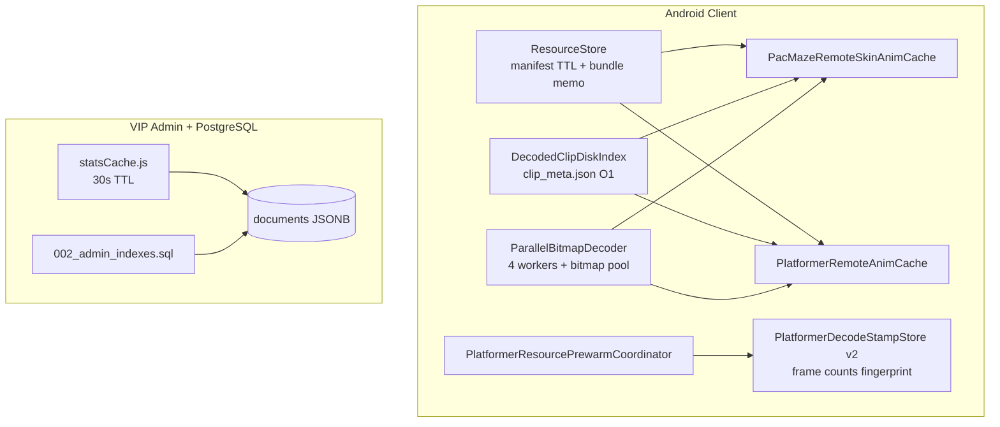

# FunLife 缓存性能企业级方案（Runbook v1.0）

> 适用范围：Android 客户端游戏资源缓存 + VIP 管理后台 PostgreSQL 查询加速  
> 关联部署：[offboard-tencent-cloud.md](./offboard-tencent-cloud.md)  
> 最后更新：2026-06-20

---

## 1. 背景与问题陈述

### 1.1 用户感知

- 二次启动进入 PacMaze / 横版平台仍出现「解析全动画…」长等待
- 选角页封面偶发转圈
- VIP 管理后台（`localhost:3300`）仪表盘加载慢或超时

### 1.2 根因（已验证）

| 层级 | 现象 | 根因 |
|------|------|------|
| L0 资源包 | 每次 `ensureBundle` 重复 stat | manifest 无 TTL；bundle ready 无 memo |
| L1 磁盘解码 | 有 PNG 仍慢 | 每次 cache hit 仍全量 `BitmapFactory.decodeFile`（如小鸡 122 帧） |
| L2 完整性校验 | 启动预检慢 | `listFiles()` 扫描目录；无 sidecar 索引 |
| L3 主线程 | StrictMode 告警 | `Application.onCreate` / Compose 中同步磁盘 I/O |
| L4 后台 Admin | PG 仪表盘慢 | 多 SKU `count()` 无索引；`ORDER BY at` 全表扫 |

---

## 2. 架构总览



### 2.1 设计原则

1. **读路径分层**：内存 → 磁盘 sidecar → 并行 decode → zip 解压（最后手段）
2. **主线程零磁盘**：所有 bundle / cover / completeness 检查走 `Dispatchers.IO`
3. **版本强一致**：decode tag + bundle version + frame count 三重校验
4. **向后兼容**：无 `clip_meta.json` 的旧缓存自动 scan 并补写 meta
5. **可观测**：StrictMode（Debug）、Admin stats cache hit、部署脚本 migration 步骤

---

## 3. 客户端实现清单

### 3.1 ResourceStore（`app/.../resource/ResourceStore.kt`）

| 能力 | 说明 | TTL / 策略 |
|------|------|------------|
| `bundleReadyMemo` | 避免重复 `resourceExists` 风暴 | 5 分钟 |
| `cachedManifest` + SP 持久化 | 离线启动不拉 manifest | 15 分钟 |
| `resourceExistsMemo` | 单文件 stat 缓存 | 随 bundle memo 失效 |
| `prefetchResourceExists()` | 批量预热路径存在性 | IO 线程 |
| `isBundleReadyAsync()` | 异步 bundle 检查 | IO 线程 |
| `invalidateBundleReadyMemo()` | 下载/清缓存后调用 | — |
| `invalidateManifestCache()` | manifest 变更后调用 | — |

**调用约定**

- UI / `Application`：**禁止**直接 `isPacMazeBundleReady()`，改用 `isBundleReadyAsync()` 或在 IO 协程内调用
- 资源包更新完成后：必须 `invalidateBundleReadyMemo(bundleId)` + `invalidateManifestCache()`

### 3.2 DecodedClipDiskIndex（`DecodedClipDiskIndex.kt`）

磁盘 sidecar：`clip_meta.json`

```json
{
  "v": 2,
  "frameCount": 61,
  "decodeTag": "norm_bv3",
  "format": "webp",
  "files": ["0000.webp", "0001.webp", "..."]
}
```

| API | 复杂度 | 用途 |
|-----|--------|------|
| `frameCount(dir, tag)` | O(1) | 预检是否需要 re-decode |
| `isComplete(dir, expected, tag)` | O(1) | 跳过 zip 解压 |
| `listFrameFiles(dir, tag)` | O(1) meta / O(n) fallback | 并行 decode 输入 |
| `writeMetaFromFiles(...)` | — | 新 decode 完成后写入 |

**缓存目录**

```
files/resource_cache/
├── decoded_pac_maze_skins/{decodeTag}/{skinId}/{clip}/
├── decoded_platformer_characters/{decodeTag}/{catalogId}/{clip}/
└── pac_maze_covers/{skinId}_cover.webp
```

### 3.3 ParallelBitmapDecoder（`ParallelBitmapDecoder.kt`）

- 默认 **4 worker** 并行 decode
- `inBitmap` 复用池（max 8）
- 支持 PNG / WebP 帧文件
- 进度回调供 UI overlay 使用

### 3.4 PacMazeRemoteSkinAnimCache

| 变更 | 详情 |
|------|------|
| 磁盘索引 | 读写 `clip_meta.json` |
| 并行加载 | `ParallelBitmapDecoder.decodeFilesParallel` |
| WebP 落盘 | 新 decode 写 WebP + meta（体积更小） |
| 内存 LRU | `MAX_FULL_ANIM_SKINS` 2 → **4** |
| 封面分离 | `hasCoverCache()` 仅内存；`hasCoverCacheOnDisk()` 供 IO |
| 平台小鸡 | `diskClipFrameCount()` / `isPlatformerSkinOnDisk()` |

### 3.5 PlatformerRemoteAnimCache

与 PacMaze 对齐：索引 + 并行 decode + WebP meta + `playbackFrameCount()` / `isDiskPlayableReady()`

### 3.6 PlatformerDecodeStampStore v2

Structured stamp（SharedPreferences `platformer_decode_stamp_v2`）：

| 字段 | 用途 |
|------|------|
| `skinsBundleVer` / `platformerBundleVer` | bundle 版本 |
| `pacMazeDecodeTag` / `platformerDecodeTag` | decode 目录 tag |
| `chickWalkFrames` / `chickJumpFrames` | 小鸡 clip 帧数 |
| `catalogId` + walk/jump frames | 默认 catalog 角色 |

**PlatformerResourcePrewarmCoordinator** 在跳过 decode 前校验 stamp 与磁盘帧数一致；完成后 `persistDecodeStampIfComplete()`。

### 3.7 主线程 I/O 修复

| 文件 | 修复 |
|------|------|
| `FunLifeApplication.kt` | cover warm 移至 IO；bundle check 用 `isBundleReadyAsync` |
| `PacMazeRemoteSkinLoadOverlay.kt` | `hasCoverCacheOnDisk()` 在 `LaunchedEffect` + IO |

---

## 4. 服务端实现清单

### 4.1 PostgreSQL 索引（`backend/migrations/postgres/002_admin_indexes.sql`）

| 索引 | 集合 | 加速查询 |
|------|------|----------|
| `idx_vip_redeem_log_at` | vip_redeem_log | `ORDER BY at`, 7 日 count |
| `idx_vip_users_registered_at` | vip_users | 用户列表 |
| `idx_vip_coin_logs_at` | vip_coin_logs | 积分流水 |
| `idx_vip_admin_audit_at` | vip_admin_audit | 审计 |
| `idx_vip_codes_sku_status` | vip_codes | 仪表盘 bySku count |

**应用方式**

```bash
psql $DATABASE_URL -f backend/migrations/postgres/002_admin_indexes.sql
```

部署脚本 `pocketbase/tools/deploy-offboard-tencent.ps1` 在 Postgres healthy 后自动执行 001 + 002。

### 4.2 Admin Stats Cache（`backend/admin/statsCache.js`）

| 接口 | 缓存键 | TTL |
|------|--------|-----|
| `GET /api/stats` | `dashboard` | 30s（`ADMIN_STATS_CACHE_TTL_MS` 可覆盖） |
| `GET /api/stats/chat_ai_products` | `chat_ai_products` | 30s |

**写操作自动失效**：generate / toggle / delete / reset / update / force_migrate

---

## 5. 部署与运维

### 5.1 一键部署（含 migration + admin 重建）

```powershell
cd d:\soft\pocketbase\tools
.\deploy-offboard-tencent.ps1
```

变更点（v1.0）：

1. Postgres healthy 后自动跑 `001_documents.sql` + `002_admin_indexes.sql`
2. API 重建后 **始终** recreate `funlife-vip-admin`（避免 DATABASE_URL 密码漂移）

### 5.2 Admin 密码不一致排查

```powershell
docker logs funlife-vip-admin --tail 50
# password authentication failed → recreate:
docker rm -f funlife-vip-admin
cd d:\soft\pocketbase
docker compose --profile admin up -d vip-admin
```

### 5.3 客户端清缓存（客服脚本）

```
设置 → 应用 → FunLife → 存储 → 清除数据
```

或 adb：

```bash
adb shell run-as com.example.funlife rm -rf files/resource_cache/decoded_*
```

---

## 6. 验证清单

### 6.1 Android（Debug + StrictMode）

```powershell
cd d:\soft
.\gradlew :app:compileDebugKotlin
```

手动验证：

1. **冷启动** → 无 StrictMode disk read on main thread
2. **二次启动** → 不弹「解析全动画」横幅（stamp + 磁盘完整）
3. **选角页** → 封面秒开（磁盘 cover.webp）
4. **切换皮肤** → overlay 显示 Decoding 而非 Downloading（有磁盘缓存时）

### 6.2 Admin

```powershell
# 首次（冷缓存）
Measure-Command { Invoke-RestMethod http://127.0.0.1:3300/api/stats -Headers @{Cookie="..."} }
# 30s 内第二次应明显更快
```

### 6.3 索引确认

```sql
SELECT indexname FROM pg_indexes
WHERE tablename = 'documents' AND indexname LIKE 'idx_vip%';
```

---

## 7. 故障排查

| 症状 | 检查 | 处理 |
|------|------|------|
| 每次启动 re-decode | `clip_meta.json` 是否存在 | 看 logcat `PacMazeRemoteSkinAnim`；确认 bundle_version 未变 |
| stamp 跳过但动画缺帧 | `PlatformerDecodeStampStore` vs 磁盘 | 删除 SP key `platformer_decode_stamp_v2`，重启 |
| Admin 仪表盘 500 | `docker logs funlife-vip-admin` | 重建容器；确认 migration 002 已应用 |
| Admin 数据 stale | stats cache | 等 30s 或重启 admin；写操作会自动 invalidate |
| manifest 不更新 | `lastFetchedManifestVersion` | 调用 `ResourceStore.invalidateManifestCache()` |

---

## 8. Phase 2 路线图（未实施）

> 当前 v1.0 已覆盖磁盘索引 + 并行 decode + 后台 PG 加速。以下为下一迭代。

| 项目 | 收益 | 复杂度 |
|------|------|--------|
| GPU Atlas 纹理缓存 | 消除逐帧 draw 开销 | 高 |
| 分级加载（低分辨率 boot → 高清替换） | 首帧更快 | 中 |
| Room 元数据表 | 跨进程 cache index | 中 |
| Prometheus `/metrics` on admin | 生产可观测 | 低 |

---

## 9. 变更文件索引

### Android（新增）

- `app/.../resource/DecodedClipDiskIndex.kt`
- `app/.../resource/ParallelBitmapDecoder.kt`
- `app/.../resource/PlatformerDecodeStampStore.kt`

### Android（修改）

- `app/.../resource/ResourceStore.kt`
- `app/.../ui/.../PacMazeRemoteSkinAnimCache.kt`
- `app/.../game/platformer/catalog/PlatformerRemoteAnimCache.kt`
- `app/.../game/platformer/catalog/PlatformerResourcePrewarmCoordinator.kt`
- `app/.../FunLifeApplication.kt`
- `app/.../PacMazeRemoteSkinLoadOverlay.kt`

### Backend（新增）

- `backend/migrations/postgres/002_admin_indexes.sql`
- `backend/admin/statsCache.js`

### Backend（修改）

- `backend/admin/server.js`

### 部署（修改）

- `pocketbase/tools/deploy-offboard-tencent.ps1`

---

## 10. 版本历史

| 版本 | 日期 | 说明 |
|------|------|------|
| v1.0 | 2026-06-20 | 完整企业级 v1：sidecar 索引、并行 decode、stamp v2、主线程修复、PG 索引、admin TTL cache、部署脚本 |
