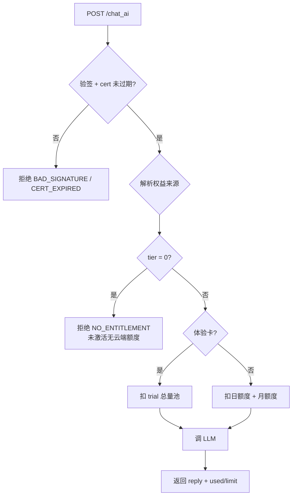

# 聊天记账 · AI 额度权益模型 v2（设计稿）

> **文档性质：** 产品设计 + 技术约束（**仅设计，未实施**）  
> **替代范围：** 取代 `chat_ai_quota_card_design.md` 中 §二 SKU 表、§四 额度规则、以及「未激活每日 20 条」相关描述  
> **背景：** v1 已实现卡密兑换与云端 LLM，但权益模型存在商业与成本漏洞，需先定规则再改代码。

**关联文档：**

| 文档 | 关系 |
|------|------|
| `chat_ai_quota_card_design.md` | v1 实现参考（UI、兑换流程、安全） |
| 本文 v2 | **权益与 SKU 的权威定义**（实施前以本文为准） |

---

## 一、v1 问题诊断

### 1.1 商业漏洞

| 问题 | 现状（v1） | 后果 |
|------|------------|------|
| **未激活仍有日额度** | tier 0 = **20 条/天** 云端额度展示 | 用户不买卡也能长期白嫖 LLM；多账号/多设备可放大成本 |
| **「每日免费」语义** | UI 写「未激活 · 免费体验 今日 x/20」 | 用户理解为「每天都能领」，与付费卡价值冲突 |
| **未激活能否调云端** | 客户端无凭证时降级本地；有凭证才走云端，但 tier 0 在服务端仍按 20 条扣 | 规则不一致：展示有额度、实际常走本地，体验混乱 |
| **高档 = 无限** | PRO / 年卡 tier 3 → **无限条/天** | API 成本不可控；恶意刷量无法封顶 |
| **档位与 VIP 混用** | `chatAiTier` 1/2/3 对齐 VIP1/2/3 数字 | 运营难以理解「买 AI 卡」与「买 VIP」差额；调价困难 |

### 1.2 设计目标（v2）

1. **未激活 = 零云端额度**，不能「每天领」；仅提供**零成本**本地规则回复。  
2. **付费才有云端 LLM**；可选**一次性体验卡**（非每日重置）。  
3. **分档清晰**：日上限 + 月上限双轨，取消「无限」档。  
4. **云端权威**：无有效凭证 → 拒绝调 LLM；客户端不做「善意放行」。  
5. **与 VIP 叠加**：取权益较高档，但不向未付费用户泄漏 VIP 级额度。

---

## 二、核心原则

### 2.1 三种回复通道

```
用户发消息
    │
    ├─► [A] 本地规则引擎     ─ 未激活可用，零 API 成本，不计入付费额度
    │
    ├─► [B] 云端 LLM         ─ 必须有权益来源（体验卡 / AI 卡 / VIP），服务端扣费
    │
    └─► [C] 混合策略         ─ 见 §5.2（未激活默认只走 A）
```

### 2.2 权益来源（Entitlement Source）

同一时间，用户**最多**拥有一个「有效云端 AI 权益」，由以下来源取 **max**：

| 来源代码 | 含义 | 是否需凭证 |
|----------|------|------------|
| `NONE` | 未激活 | 否（不调云端） |
| `TRIAL` | 体验卡（一次性池） | 是 |
| `CARD` | 付费 AI 卡 | 是 |
| `VIP` | 会员 VIP 聊天权益 | 是（VIP 凭证） |

**禁止：**

- 未激活用户每日自动恢复云端额度  
- 签到 / 广告 / 分享领取云端额度（若未来要做，单独立项，不走 tier 0）  
- 客户端内置 API Key 作为正式用户通道（仅 Debug）

### 2.3 计数口径（不变）

- **计入云端额度：** 每条 `ChatMessage.role = ai` 且 **来自云端 LLM** 的回复  
- **不计入：** 本地规则引擎回复、账单识别 `detectBill`、用户消息  
- **双端一致：** 云端 `chat_ai_quota` 为权威；客户端 `countAiBetween` 仅作 UI 预估，以云端返回 `used/limit` 为准

---

## 三、用户分层与权益矩阵

### 3.1 分层总览

| 用户状态 | 本地规则回复 | 云端 LLM | 顶栏/弹窗主文案 |
|----------|--------------|----------|-----------------|
| **未激活** | ✅ 可用 | ❌ **0 条** | 「未激活 · 仅本地智能回复」 |
| **体验卡生效中** | ✅ | ✅ 剩余 **N/总量**（非每日重置） | 「体验中 · 剩余 x/5 条」 |
| **标准卡 / 进阶卡 / 专业卡** | ✅ | ✅ 按日上限 + 月上限 | 「已激活 · {套餐名}」 |
| **VIP 会员（无 AI 卡）** | ✅ | ✅ 按 VIP 聊天档位 | 「VIP 权益 · x 条/天」 |
| **VIP + AI 卡** | ✅ | ✅ **取较高档** | 「VIP + AI 卡 · 按较高档计费」 |
| **套餐过期** | ✅ | ❌ 0 条 | 「已过期 · 请激活新卡密」 |

### 3.2 未激活用户策略（重点）

**明确不做：**

```
❌ 每日 20 条免费云端额度
❌ 每日登录领取 AI 次数
❌ 无凭证调用 /chat_ai 后按 tier 0 扣 20 条
```

**明确要做：**

```
✅ 本地人格规则回复（现有 ruleEngine / getLocalChatReply）— 永久免费
✅ UI 诚实展示：「云端 AI 需激活卡密」，不显示「今日 x/20」
✅ 可选：引导用户兑换「体验卡」或购买月卡（见 §4.1）
```

**产品话术：**

> 未激活时，记账助手会用**本地智能回复**陪你记账；激活 AI 卡密后，可升级为**云端大模型**对话，回复更自然、更懂上下文。

---

## 四、SKU 与额度表（重新设计）

### 4.1 SKU 一览

> 档位代号 `chatAiTier` 与 VIP `vipLevel` **数字脱钩**，仅表示「聊天 AI 权益等级」。

| SKU | 对外名称 | tier | 有效期 | 日上限 | 月上限* | 参考价 | 说明 |
|-----|----------|------|--------|--------|---------|--------|------|
| — | **未激活** | **0** | — | **0** | — | — | 仅本地规则 |
| `CHAT_AI_TRIAL` | 体验包 | **1** | 7 天 | — | **5 条总量** | ¥0 / 运营赠送 | 每设备终身 1 次 |
| `CHAT_AI_BASIC` | 标准月卡 | **2** | 30 天 | **30 条/天** | **600 条/月** | ¥12.9 | 轻度用户 |
| `CHAT_AI_PLUS` | 进阶月卡 | **3** | 30 天 | **80 条/天** | **1,500 条/月** | ¥24.9 | 日常重度 |
| `CHAT_AI_PRO` | 专业月卡 | **4** | 30 天 | **150 条/天** | **3,500 条/月** | ¥39.9 | 高频用户 |
| `CHAT_AI_PRO_YEAR` | 专业年卡 | **4** | 365 天 | **150 条/天** | **3,500 条/月** | ¥99 | 同 tier4 权益，长效 |

\* **月上限：** 自然月（东八区）累计云端 AI 条数，与「日上限」**同时生效**，先到先拦。

**相对 v1 变更摘要：**

| 项目 | v1 | v2 |
|------|----|----|
| 未激活日额度 | 20 | **0** |
| BASIC 日额度 | 80 | **30** |
| PLUS 日额度 | 200 | **80** |
| PRO | 无限 | **150/天 + 3500/月** |
| 体验卡 | 无 | **新增 TRIAL，5 条总量** |
| tier 编号 | 1/2/3 | **0~4 独立体系** |

### 4.2 成本与定价逻辑（运营参考）

假设 DeepSeek 类模型约 ¥0.002–0.01/条（视 token 而定）：

| 套餐 | 月理论峰值条数 | 成本粗算（按 ¥0.005/条） |
|------|----------------|--------------------------|
| BASIC | min(30×30, 600) = 600 | ~¥3 |
| PLUS | min(80×30, 1500) = 1500 | ~¥7.5 |
| PRO | min(150×30, 3500) = 3500 | ~¥17.5 |

定价保留毛利与渠道成本；**月上限**防止脚本 24 小时打满日额度。

### 4.3 体验卡 `CHAT_AI_TRIAL` 规则

| 规则 | 说明 |
|------|------|
| 总量 | **5 条**云端 LLM（终身池，激活后 7 天内用完，过期作废） |
| 设备限制 | 每 `deviceId` **终身仅可激活 1 张**体验卡（DB 标记 `trialUsedAt`） |
| 账号限制 | 每 `userId` 终身 1 张（防换号刷） |
| 发放 | 后台批次生成；App 内**不展示领取按钮**，仅客服/活动发放 |
| 与付费卡关系 | 体验用完后须购月卡；**不可**与付费卡「续期」叠加为 tier 续期 |

### 4.4 多张付费卡叠加（不变更语义，tier 数字更新）

| 场景 | 行为 |
|------|------|
| 无生效卡 | 新卡激活，从今日起算有效期 |
| 新卡 tier **更高** | 升档，到期日按新卡重算 |
| 新卡 tier **相同** | **延长**到期日（+30 / +365 天） |
| 新卡 tier **更低** | 拒绝，`TIER_TOO_LOW` |
| 已过期 | 视为无卡，按新卡激活 |

---

## 五、调用策略（客户端 + 云端）

### 5.1 云端 `/chat_ai` 门禁（v2）



**新增错误码：**

| code | 含义 | 客户端行为 |
|------|------|------------|
| `NO_ENTITLEMENT` | 无云端权益（tier 0 / 无凭证） | 走本地规则，提示激活 |
| `MONTHLY_CAP` | 月上限用尽 | Toast + 引导升级档位 |
| `TRIAL_EXHAUSTED` | 体验条数用尽 | 引导购买月卡 |

### 5.2 客户端发送策略

| 用户状态 | `consumeChatAiQuota` | `tryCloudReply` | 失败降级 |
|----------|----------------------|-----------------|----------|
| 未激活 | **不消耗**（无云端额度） | **不调用** | 直接本地规则 |
| 有权益 | 本地预检日/月 | 调用 `/chat_ai` | 仅网络错误可降级本地；`NO_ENTITLEMENT` 不降级 |

**关键变更：** 未激活时 **禁止** 为「尝试云端」而调用 `/chat_ai`（避免无意义请求与规则漏洞）。

### 5.3 VIP 权益对齐

VIP 用户聊天 AI 权益**单独一张表**，与 AI 卡 tier 取 max：

| VIP 等级 | 聊天 AI 日上限 | 聊天 AI 月上限 |
|----------|----------------|----------------|
| 无 VIP / VIP0 | 0 | — |
| VIP1 | 30 | 600 |
| VIP2 | 80 | 1,500 |
| VIP3 / 永久 | 150 | 3,500 |

> VIP 月上限与 AI 卡 PRO 对齐，避免 VIP3「无限」漏洞。若运营需保留 VIP3 无限，须单独立项并评估成本。

**有效档位：**

```
effectiveTier = max(activeCardTier, activeVipChatTier, 0)
dailyLimit    = LIMIT_TABLE[effectiveTier].daily    // tier 0 → 0
monthlyLimit  = LIMIT_TABLE[effectiveTier].monthly  // tier 0 → 0
```

---

## 六、额度存储（云端数据模型）

### 6.1 集合设计

| 集合 | Key | 字段 | 用途 |
|------|-----|------|------|
| `chat_ai_quota` | `deviceId + ymd` | `count` | **日**扣费（已有） |
| `chat_ai_quota_month` | `deviceId + ym` | `count` | **月**扣费（**新增**） |
| `chat_ai_trial` | `deviceId` | `totalUsed`, `maxTotal`, `expireAt` | 体验卡总量池（**新增**） |
| `vip_codes` | `code` | `skuCode`, `chatAiTier`, `productType`… | 卡密（已有） |

### 6.2 扣费顺序

1. 验签、解析 `effectiveTier`  
2. 若 `tier === 0` → `NO_ENTITLEMENT`  
3. 若来源为 `TRIAL` → 查 `chat_ai_trial`，`totalUsed >= maxTotal` → `TRIAL_EXHAUSTED`  
4. 查日额度 `chat_ai_quota`  
5. 查月额度 `chat_ai_quota_month`  
6. 调 LLM；失败回滚日/月/trial 计数  

### 6.3 响应字段扩展

```json
{
  "ok": true,
  "reply": "...",
  "used": 12,
  "limit": 30,
  "usedMonth": 245,
  "limitMonth": 600,
  "tier": 2,
  "source": "CARD",
  "poolType": "daily"
}
```

`poolType`: `daily` | `monthly` | `trial_total`

---

## 七、UI / 文案变更（相对 v1）

### 7.1 状态条矩阵（修订）

| 状态 | 标题 | 副标题 |
|------|------|--------|
| `INACTIVE` | ○ 未激活 | 本地智能回复可用 · **激活卡密解锁云端 AI** |
| `TRIAL` | ◐ 体验中 | 剩余 **{left}/5** 条 · 有效期至 {date} |
| `ACTIVE_CARD` | ● 已激活 | 今日 **{used}/{daily}** · 本月 **{usedM}/{monthly}** |
| `ACTIVE_VIP` | ● VIP 权益 | 今日 **{used}/{daily}** · 本月 **{usedM}/{monthly}** |
| `EXHAUSTED_DAY` | ⚠ 今日已满 | 明日恢复 · 或升级更高档位 |
| `EXHAUSTED_MONTH` | ⚠ 本月已满 | 下月恢复 · 或联系客服 |
| `EXPIRED` | ○ 已过期 | 仅本地回复 · 请激活新卡密 |

**删除文案：** 「未激活时每日免费 20 条」「今日 x/20 条免费体验」

### 7.2 菜单绿点逻辑

| 绿点 | 条件 |
|------|------|
| 亮 | `effectiveTier > 0` 且日/月/体验池尚有剩余 |
| 灰 | 未激活，或额度用尽，或已过期 |

### 7.3 套餐说明区（弹窗折叠）

按 §4.1 表展示四档付费 + 体验卡说明；强调 **「云端 AI 需激活，未激活仅用本地回复」**。

---

## 八、安全与防刷

| 风险 | 对策 |
|------|------|
| 多设备刷体验卡 | `deviceId` 终身 1 次 + `userId` 终身 1 次 |
| 无凭证撞 `/chat_ai` | tier 0 硬拒绝 `NO_ENTITLEMENT` |
| 日上限打满换月 | 月上限并行校验 |
| 伪造 tier | 服务端 `resolveQuotaTier` 只信 DB 已用卡 + 验签 cert，客户端传的 tier 忽略 |
| 本地计数作弊 | 正式包以云端 `used/limit` 为准；超额后禁止再调云端 |
| 旧凭证无 `productType` | 复兑一次换发新 cert（v1 已说明，v2 仍适用） |

---

## 九、与 v1 实现的差异清单（实施对照表）

实施 v2 时需修改（**本文不实施，仅列清单**）：

| 层级 | 文件/模块 | 变更 |
|------|-----------|------|
| SKU | `backend/shared/sku.js` | 新增 TRIAL；调整 tier 2/3/4 与月上限元数据 |
| 兑换 | `backend/functions/redeem/index.js` | TRIAL 设备/账号终身校验；tier 映射更新 |
| 聊天 AI | `backend/functions/chat_ai/index.js` | 删除 tier0=20；月额度集合；`NO_ENTITLEMENT` |
| 客户端额度 | `VipQuota.kt` | 新 `LIMIT_TABLE`；tier 0 → 0 |
| ViewModel | `ChatViewModel.kt` | 未激活不调云端；月额度 UI |
| 云客户端 | `ChatAiCloudRepository.kt` | 解析 `usedMonth/limitMonth` |
| UI | `ChatAiQuotaDialog.kt` / `ChatAiQuotaBanner.kt` | 文案与状态枚举 |
| 后台 | `admin/server.js` | TRIAL 批次；统计按月 |
| 测试 | `test_chat_ai_card_e2e.js` | tier0 拒绝；月上限；TRIAL 池 |
| 文档 | `chat_ai_quota_card_design.md` | 头部注明「额度以 v2 为准」 |

---

## 十、迁移策略

### 10.1 已购 v1 卡密用户

| 原 SKU (v1 tier) | 迁移到 v2 |
|------------------|-----------|
| CHAT_AI_BASIC (tier1→80/天) | **就高不就低**：过渡期内按 80/天直至到期；到期后续费按 v2 新表 |
| CHAT_AI_PLUS (tier2→200/天) | 过渡 200/天直至到期 |
| CHAT_AI_PRO 无限 | 过渡改为 **150/天 + 3500/月** 直至到期，提前 7 天 App 内公告 |

**推荐：** 服务端 `sku.js` 增加 `legacyChatAiTier` 字段，按 `usedAt` 区分老卡与新卡。

### 10.2 已上线 App

- 发版说明：「未激活不再赠送每日 20 条云端对话，请激活卡密或继续使用本地回复」  
- 避免用户感知为「被砍权益」：强调本地回复仍可用，云端需激活。

---

## 十一、实施阶段建议

| 阶段 | 内容 | 优先级 |
|------|------|--------|
| **P0** | 云端 tier0=0 + `NO_ENTITLEMENT`；客户端未激活不调 `/chat_ai` | 必须（堵漏洞） |
| **P1** | SKU 表与 UI 文案更新；去掉「每日 20 条」展示 | 必须 |
| **P2** | 月额度集合 `chat_ai_quota_month` | 高 |
| **P3** | 体验卡 `CHAT_AI_TRIAL` + 防刷 | 中 |
| **P4** | VIP 月上限对齐；老卡 legacy 迁移 | 中 |
| **P5** | 后台月统计、客服工具 | 低 |

---

## 十二、验收标准（v2）

1. **未激活**用户连续聊天 100 条，**云端 LLM 调用次数 = 0**，仅本地回复。  
2. **未激活** UI **不出现**「今日 x/20」或「每日领取」。  
3. **BASIC 卡**用户第 31 条当日云端请求返回 `QUOTA_EXCEEDED`（日上限 30）。  
4. **BASIC 卡**用户月累计 601 条返回 `MONTHLY_CAP`。  
5. **体验卡**第 6 条返回 `TRIAL_EXHAUSTED`；同设备第二张体验卡兑换失败。  
6. **PRO 卡**不存在「无限」展示；日 151 条被拒绝。  
7. E2E 脚本覆盖 tier0 拒绝 + 分档日/月上限 + TRIAL 池。

---

## 十三、待产品确认项

实施前请确认：

- [ ] **未激活是否完全 0 云端**，还是保留「注册送 3 条终身」？（本文默认 **完全 0**，体验走 TRIAL 卡）  
- [ ] **VIP3 是否改为 150/天 + 3500/月**，还是保留 VIP 无限？  
- [ ] **老卡就高迁移**是否接受，还是统一按新表立即生效？  
- [ ] **定价**是否沿用 §4.1 参考价  

---

**文档版本：** v2.0 · 2026-06-05  
**状态：** ✅ 已编码（P0–P3）；部署后跑 `test_chat_ai_card_e2e.js` 验收
