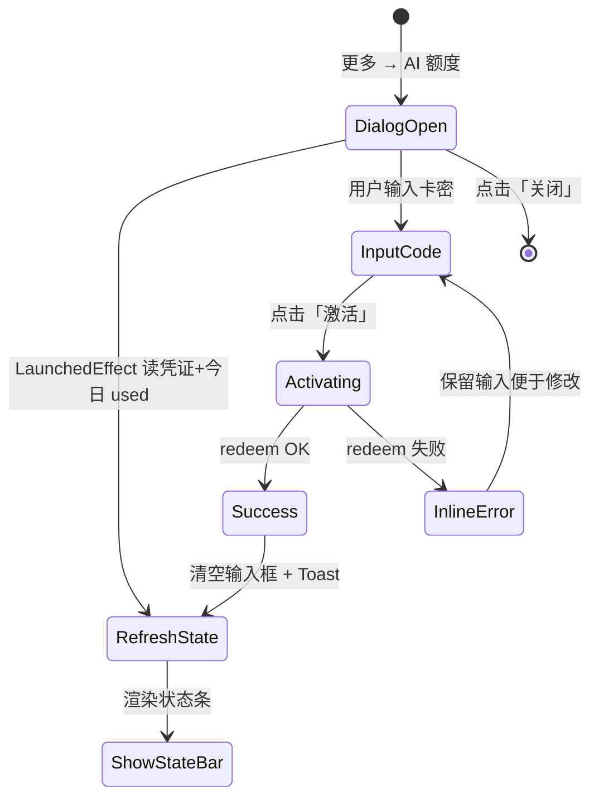
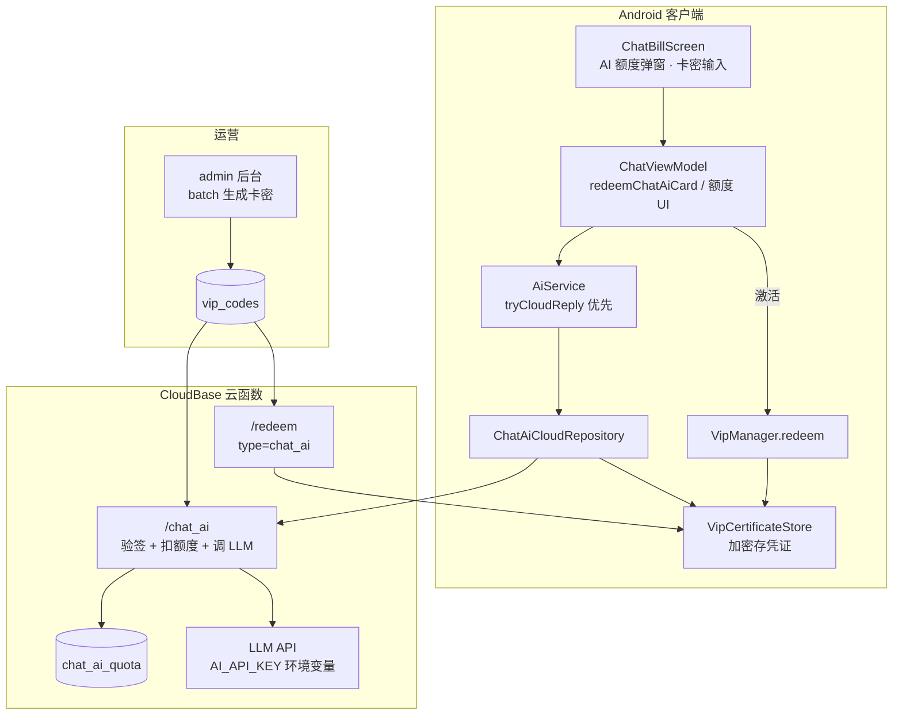

# 💬🤖 聊天记账 · AI 额度卡密 — 产品与技术设计方案

> **核心变更：** 聊天记账页「AI 设置 → 输入 API Key」改为 **「AI 额度 → 输入卡密领取额度」**。  
> API Key 仅部署在云端，用户购买卡密即可使用人格 AI 回复，无需自行配置密钥。

**文档状态：** P0/P1 已实现 · 2026-06 已部署生产 `redeem` + `chat_ai`  
**E2E 脚本：** `backend/tools/test_chat_ai_card_e2e.js` · 部署：`backend/deploy-chat-ai-card.ps1`  
**UI 基准：** `ChatBillScreen.kt` L556–632 · 现有 `AlertDialog`「AI 智能设置」弹窗

> ⚠️ **权益与 SKU 额度表：** v1 中「未激活每日 20 条」、分档数字、无限档等规则 **已由 v2 取代**。  
> 实施前请以 **`docs/chat_ai_entitlement_model_v2.md`** 为准；本文保留 UI/兑换/安全实现参考。

---

## 一、背景与目标

### 1.1 现状问题

| 现状 | 问题 |
|------|------|
| 聊天页「更多 → AI 设置」要求输入 **API Key** | 面向开发者，普通用户不会配置；Key 泄露风险高 |
| 已有 VIP 卡密体系 | 卖的是**整包 VIP**（金币、信箱、书房等），不是「纯聊天 AI 额度」 |
| `CHAT_AI_USE_PROXY=true` 时云端已可调 LLM | 用户侧入口仍像「自备 Key」，与商业化售卖脱节 |

### 1.2 目标

1. **售卖：** 发行多档位「聊天 AI 额度卡密」，淘宝/私域发货，用户兑换即用。  
2. **体验：** 在**聊天记账页**完成卡密激活与额度查看，路径短、语义清晰。  
3. **安全：** 开发者 API Key **只存云端** `chat_ai` 云函数，不进 APK、不下发给用户。  
4. **兼容：** 已有 VIP 用户仍按 VIP 等级享受 AI 额度；AI 卡与 VIP **取较高档**，不互相降级。

### 1.3 非目标（本期不做）

- 不做 App 内购 / 微信支付（仅卡密兑换）。  
- 不把 AI 卡升级为全套 VIP。  
- 不在聊天页保留「用户自填 API Key」入口（正式包隐藏；Debug 包可保留开发者开关）。

---

## 二、产品定义 · 售卖 SKU

沿用云端 `chat_ai` 已有日额度表（与 `VipQuota.chatAiDailyLimit` / `DAILY_TABLE_CHAT` 一致）：

| SKU 代号 | 商品名（对外） | chatAiTier | AI 条数/天 | 有效期 | 参考定价 |
|----------|----------------|------------|------------|--------|----------|
| `CHAT_AI_BASIC` | 聊天AI·标准包 | 1 | **80** | 30 天 | ¥9.9 |
| `CHAT_AI_PLUS` | 聊天AI·进阶包 | 2 | **200** | 30 天 | ¥19.9 |
| `CHAT_AI_PRO` | 聊天AI·专业包 | 3 | **无限** | 30 天 | ¥39.9 |
| `CHAT_AI_PRO_YEAR` | 聊天AI·年包 | 3 | **无限** | 365 天 | ¥99 |

**计数规则（与现网一致）：**

- 每产生 **1 条 AI 人格回复**（`ChatMessage.role = ai`）计 **1 次**。  
- **不计入：** 本地规则引擎回复、`detectBill` 账单识别、用户自己发的消息。  
- **免费档（未激活卡）：** tier 0 → **20 条/天**（本地规则为主，有网时仍可尝试云端）。

**SKU 元数据（`backend/shared/sku.js` 扩展）：**

```javascript
CHAT_AI_BASIC: {
  type: "chat_ai",       // 区别于 "vip"
  name: "聊天AI·标准包",
  price: 9.9,
  chatAiTier: 1,
  durationDays: 30,
  bonusCoins: 0,
  vipLevel: 0,             // 明确：不写入 UserVip 表
}
```

---

## 三、用户旅程 · 聊天页改造（重点）

> **本需求唯一 UI 载体：** 沿用现有 `showAiDialog` 弹窗位置与 `AlertDialog` 容器，**不重开新页面**；仅替换内容与交互语义。

### 3.1 现状弹窗 · 逐组件对照（基于截图 / 代码）

当前实现（`ChatBillScreen.kt` L556–632）：

| # | 组件 | 现状文案 / 行为 | 改造后 |
|---|------|----------------|--------|
| A | 更多菜单项 | 「AI 设置」+ 绿/橙点 = `isAiAvailable`（Key 是否有效） | **「AI 额度」** + 绿/橙点 = **是否有生效额度来源**（AI 卡 / VIP / 免费可用） |
| B | 弹窗标题 Row | 🤖 + **「AI 智能设置」** | 🤖 + **「AI 额度」**（副标题可省略，保持单行标题） |
| C | 状态条 Row | 绿/橙底 · 「✅ 已连接 灵犀 AI」/「⚠️ 未配置 API Key」 | **额度状态条**（见 §3.3 状态矩阵） |
| D | 说明 Text | 「输入 API Key 启用灵犀 AI…不填则使用本地规则引擎。」 | 「输入购买的 AI 卡密，激活智能对话额度。\n未激活时每日免费 20 条，超额后使用本地规则回复。」 |
| E | OutlinedTextField | label `API Key` · placeholder `sk-...` | label **「卡密」** · placeholder **`FL-XXXX-XXXX-XXXX`** · `keyboardType = Text` · 自动转大写、去空格 |
| F | 底部小字 | 「未配置时使用本地规则引擎…」 | 「激活后立即生效；一卡一账号，不可转让」 |
| G | 主按钮 | **「保存」** → `setAiApiKey()` 后关闭 | **「激活」** → `redeemChatAiCard()` · 成功不关窗、刷新状态条 |
| H | 次按钮 | **「取消」** | **「关闭」**（无未提交卡密时直接关；有输入时同取消） |

**视觉继承（不改）：** `containerColor = White` · `RoundedCornerShape(20.dp)` · 状态条 `RoundedCornerShape(12.dp)` · 主按钮 `themeColor` + `RoundedCornerShape(12.dp)` · 次按钮灰色 `TextButton`。

**Debug 构建：** 在 F 下方增加 `AnimatedVisibility` 折叠区「开发者 · API Key（仅 Debug）」；Release **完全移除** A–H 中与 Key 相关的所有字段。

#### 截图场景 · 改造前后（未激活用户）

**改造前（当前截图）：**

```
🤖 AI 智能设置
┌─────────────────────────────────┐
│ ⚠️ 未配置 API Key                │  ← 橙色警告，像「出错了」
└─────────────────────────────────┘
输入 API Key 启用灵犀 AI 智能回复。
不填则使用本地规则引擎。
┌─────────────────────────────────┐
│ API Key                          │
│ sk-...                           │
└─────────────────────────────────┘
未配置时使用本地规则引擎回复…
                    [ 取消 ] [ 保存 ]
```

**改造后（同用户、同入口）：**

```
🤖 AI 额度
┌─────────────────────────────────┐
│ ○ 未激活 · 免费体验              │  ← 橙色为「待升级」，非报错
│   今日 3 / 20 条 · 激活卡密解锁更多│
└─────────────────────────────────┘
输入购买的 AI 卡密，激活智能对话额度。
未激活时每日免费 20 条，超额后使用本地规则回复。
┌─────────────────────────────────┐
│ 卡密                             │
│ FL-XXXX-XXXX-XXXX                │
└─────────────────────────────────┘
激活后立即生效；一卡一账号，不可转让
                    [ 关闭 ] [ 激活 ]
```

**关键体验差异：** 用户不再面对「配置密钥」的技术门槛，而是看到**当前额度** + **一条激活路径**；免费 20 条/天是产品能力说明，不是缺陷提示。

### 3.2 改造后弹窗 · 信息架构（线框）

```
┌──────────────────────────────────────────┐
│  🤖  AI 额度                              │  ← title Row（与现弹窗同结构）
├──────────────────────────────────────────┤
│  ┌────────────────────────────────────┐  │
│  │ ● 标准包 · 生效中                   │  │  ← 状态条（§3.3）
│  │   今日 12 / 80 条                   │  │
│  │   有效期至 2026-07-03               │  │
│  │   ──────────────────── 72%          │  │  ← 可选：LinearProgressIndicator
│  └────────────────────────────────────┘  │
│                                           │
│  输入购买的 AI 卡密，激活智能对话额度。    │  ← 说明 Text 12sp #999
│  未激活时每日免费 20 条…                  │
│                                           │
│  ┌────────────────────────────────────┐  │
│  │ 卡密                                │  │  ← OutlinedTextField
│  │ FL-XXXX-XXXX-XXXX                   │  │
│  └────────────────────────────────────┘  │
│  粘贴卡密后点击激活，立即生效              │  ← 11sp #BBB（原底部小字位）
│                                           │
│  ┌─ 错误提示（inline，仅失败时） ─────┐  │
│  │ ⚠ 卡密不存在或已被使用              │  │  ← 12sp #E65100
│  └────────────────────────────────────┘  │
│                                           │
│              [ 关闭 ]    [ 激活 ]         │  ← dismiss + confirm（位置不变）
└──────────────────────────────────────────┘
```

**与截图差异说明：**

- **去掉**「未配置 API Key」橙色警告语义，改为**额度/套餐**语义（未激活 ≠ 报错，是免费档）。  
- **状态条从二元（有 Key / 无 Key）升级为三元+**（免费 / 已激活 / VIP 覆盖 / 已过期 / 今日用尽）。  
- **主操作从「保存配置」变为「兑换商品」**，成功后状态条即时刷新，弹窗保持打开方便用户确认额度。

### 3.3 状态条 · 文案与配色矩阵

状态条仍用现有 `Row + RoundedCornerShape(12) + padding(12)` 结构，仅替换背景色、圆点色、文案。

| 状态 ID | 条件 | 背景色 | 圆点 | 主文案 | 副文案（第二行，13sp） |
|---------|------|--------|------|--------|------------------------|
| `FREE` | 无 AI 卡、无 VIP 或 VIP0 | `#FF9800` α0.1 | 橙 | ○ 未激活 · 免费体验 | 今日 **{used} / 20** 条 · 激活卡密解锁更多 |
| `ACTIVE_CARD` | 有生效 `CHAT_AI_*` 凭证 | `#4CAF50` α0.1 | 绿 | ● {套餐名} · 生效中 | 今日 **{used} / {limit}** 条 · 至 **{expire}** |
| `ACTIVE_VIP` | VIP 档位 ≥ AI 卡且无单独 AI 卡展示需求 | `#4CAF50` α0.1 | 绿 | ● VIP{level} · AI 额度已开通 | 今日 **{used} / {limit}** 条 · VIP 权益 |
| `ACTIVE_BOTH` | 同时有 AI 卡 + 更高 VIP | `#4CAF50` α0.1 | 绿 | ● 当前按 **VIP{level}** 计费 | 今日 **{used} / {limit}** 条 · AI 卡保留至 {expire} |
| `EXPIRED` | AI 卡过期、VIP 不足 | `#FF9800` α0.1 | 橙 | ○ 套餐已过期 | 今日 **{used} / 20** 条 · 请激活新卡密 |
| `EXHAUSTED` | 今日 used ≥ limit（非无限） | `#FF9800` α0.1 | 橙 | ⚠ 今日额度已用完 | **{used} / {limit}** · 明天 0 点恢复 · 或升级套餐 |
| `UNLIMITED` | tier 3 / 99 | `#4CAF50` α0.1 | 绿 | ● {套餐名} · 无限对话 | 今日已用 **{used}** 条 · 至 **{expire}** |

**`isAiAvailable` 语义调整（供菜单绿点）：**

```kotlin
// 改造前：aiService.isAvailable（Key 或 BuildConfig 有值）
// 改造后：
isAiEntitled = effectiveTier >= 0 && !isQuotaExhaustedToday
// 菜单绿点：isAiEntitled；橙点：!isAiEntitled 或 FREE/EXPIRED
```

### 3.4 交互流程



| 步骤 | 行为 |
|------|------|
| 打开弹窗 | `viewModel.refreshChatAiEntitlement()` · 读 `VipCertificateStore` + 本地 `countAiBetween` + 可选 ping 云端 quota |
| 点击「激活」 | 按钮 `enabled = code.isNotBlank() && !isRedeeming` · 显示 `CircularProgressIndicator`（按钮内 16dp） |
| 成功 | Toast：`已激活「{name}」· {limit}条/天 · 有效期至 {date}` · **不自动关窗** · 清空卡密框 |
| 失败 | 状态条下方 inline 错误 · 不关窗 · 不 Toast（避免与 inline 重复） |
| 重复激活同账号 | 按 §4.2 续期或拒绝，inline 提示原因 |

**激活成功 Toast 示例：**  
`已激活「聊天AI·标准包」· 80 条/天 · 有效期至 2026-07-03`

**激活失败文案（复用 VIP redeem 映射）：**

| 错误码 / 场景 | 弹窗 inline 文案 |
|---------------|------------------|
| 卡密不存在 | 卡密不存在，请核对后重试 |
| 已使用 | 该卡密已被使用 |
| 绑定其他账号 | 该卡密已绑定其他账号 |
| 当前套餐更高 | 你当前的 AI 额度已更高，无需更换 |
| 网络失败 | 网络异常，请稍后重试 |

### 3.5 ViewModel 数据模型（供弹窗绑定）

```kotlin
/** 弹窗专用 UI 状态，由 ChatViewModel 暴露 */
data class ChatAiEntitlementUi(
    val state: ChatAiBarState,       // FREE | ACTIVE_CARD | ACTIVE_VIP | ...
    val packageName: String?,        // "聊天AI·标准包" / "VIP2" / null
    val usedToday: Int,
    val dailyLimit: Int,             // UNLIMITED 时用 -1 表示，UI 显示「无限」
    val expireDate: String?,         // yyyy-MM-dd
    val progress: Float?,            // used/limit，无限时为 null
    val sourceLabel: String?         // "AI 卡" / "VIP 权益" / "免费"
)

enum class ChatAiBarState { FREE, ACTIVE_CARD, ACTIVE_VIP, ACTIVE_BOTH, EXPIRED, EXHAUSTED, UNLIMITED }
```

**Compose 绑定示意：**

```kotlin
// ChatBillScreen.kt · 替换 showAiDialog 块
val entitlement by viewModel.chatAiEntitlement.collectAsState()
var cardCode by remember { mutableStateOf("") }
var redeemError by remember { mutableStateOf<String?>(null) }
val isRedeeming by viewModel.isRedeemingChatAi.collectAsState()

LaunchedEffect(showAiDialog) {
    if (showAiDialog) viewModel.refreshChatAiEntitlement()
}
```

### 3.6 入口变更（菜单 + 顶栏）

| 原 | 新 |
|----|-----|
| 更多菜单 → **「AI 设置」** | **「AI 额度」** |
| 绿点 = Key 有效 | 绿点 = `state` 为 ACTIVE_* / UNLIMITED 且未 EXHAUSTED |
| 橙点 = 未配置 Key | 橙点 = FREE / EXPIRED / EXHAUSTED |

### 3.7 额度展示 · 弹窗外增强（P1/P2）

| 位置 | 优先级 | 说明 |
|------|--------|------|
| **本弹窗状态条** | P0 必做 | 今日 used/limit + 到期日（§3.3） |
| 顶栏人格副标题下 | P1 | 小字 `AI 12/80`，点击跳转打开本弹窗 |
| 输入栏上方横幅 | P2 | used/limit ≥ 80% 时「今日 AI 额度即将用完」 |
| 超额 Toast | 已有 | `consumeChatAiQuota()` 一日一次，文案改为引导「AI 额度 → 激活卡密」 |

### 3.8 与 VIP 页的关系

- **不在 VIP 页主推 AI 卡**（避免用户误以为买了 VIP）。  
- VIP 页可保留通用「兑换码」入口；若用户误兑 AI 卡，提示：「此为聊天 AI 专用卡，请前往 **聊天记账 → AI 额度** 查看」。  
- 若技术上复用同一 `/redeem` 接口，需在服务端根据 `sku.type` 区分处理。

---

## 四、额度与叠加规则

### 4.1 有效档位计算

```
effectiveTier = max(
  生效中的 chat_ai 凭证档位 chatAiTier,
  生效中的 VIP.vipLevel（若用户也是 VIP）,
  0   // 免费
)

dailyLimit = VipQuota.chatAiDailyLimit(effectiveTier)
// tier 0→20, 1→80, 2→200, 3/99→无限
```

**原则：** 已有 VIP3 的用户不会被 AI 卡「降级」；买 AI 卡主要是给**非 VIP** 或 **低 VIP** 用户单独付费。

### 4.2 多张 AI 卡策略（推荐）

| 场景 | 行为 |
|------|------|
| 无生效卡 | 直接激活，从今日起算 `durationDays` |
| 新卡 tier **更高** | 替换旧卡，重新计算到期日 |
| 新卡 tier **相同** | **延长**到期日（+30 天 / +365 天） |
| 新卡 tier **更低** | 拒绝激活，提示「当前套餐更高，无需更换」 |
| 卡已过期 | 视为无卡，按新卡激活 |

### 4.3 云端 vs 本地计数

| 层级 | 职责 |
|------|------|
| **云端** `chat_ai_quota` | **权威扣费**（按 `deviceId` + 东八区日期） |
| **本地** `ChatMessageDao.countAiBetween` | UI 展示「今日已用」、无网时预提示；与云端可能略有延迟 |

正式包以云端返回的 `used/limit` 为准（`AiService` 日志 `cloud chat ok used=1/80`）。

---

## 五、系统架构



**调用链（用户发一句「午饭 35」）：**

1. 本地 `parseBillInput` 命中 → 记账  
2. `ChatViewModel.generateReply` → `consumeChatAiQuota()` 本地预检  
3. `AiService.getReply` → `tryCloudReply` → `/chat_ai`（带 certificate + signature）  
4. 云端验签 → 按 tier 扣 `chat_ai_quota` → 调 LLM → 返回 reply  
5. 写入 AI 气泡消息  

---

## 六、数据模型

### 6.1 凭证 `VipCertificate`（方案 A · 推荐一期）

**不新增 JSON 字段**，复用现有结构，约定语义：

| 字段 | chat_ai 卡含义 |
|------|----------------|
| `skuCode` | `CHAT_AI_*` |
| `vipLevel` | **仅表示 chatAiTier**（1/2/3），**禁止**写入 `user_vip` |
| `expireDate` | AI 套餐到期日 `yyyy-MM-dd`，null=永久 |
| `bonusCoins` | 恒为 0 |
| `deviceId` / `issuedAt` / `exp` | 与 VIP 卡相同 |

客户端通过 `ChatAiSku.isChatAiSku(skuCode)` 识别，避免误升 VIP。

**方案 B（二期）：** 增加 `productType: "chat_ai"` + `chatAiTier` 独立字段，需全链路改签名。

### 6.2 卡密表 `vip_codes`（兑换时补充写入）

| 字段 | 说明 |
|------|------|
| `code` | 规范化大写无分隔符 |
| `skuCode` | `CHAT_AI_BASIC` 等 |
| `productType` | `chat_ai`（新，便于后台筛选） |
| `chatAiTier` | 1/2/3（冗余，供 `chat_ai` 查库） |
| `status` | unused / used |
| `expireDate` | 首次兑换锁定 |
| `usedByUser` | 绑定 userId |
| `usedByDevice` | 设备指纹 |

### 6.3 本地不写入的表

- **`user_vip`：** AI 卡激活 **不得** 调用 `applyCertToLocalVip`。  
- **`coin`：** `bonusCoins = 0`，不赠金币。

---

## 七、后端改造要点

### 7.1 `backend/shared/sku.js`

- 新增 4 个 `CHAT_AI_*` SKU（见 §二）。  
- 运行 `node sync-sku.js` 同步到 `functions/redeem` 等目录。

### 7.2 `/redeem` 云函数

| 改动 | 说明 |
|------|------|
| 接受 `sku.type === "chat_ai"` | 现逻辑 `type !== "vip"` 会拒绝，需放开 |
| 写入 `productType` / `chatAiTier` / `vipLevel`(tier) 到 `vip_codes` | 供 `chat_ai` 与后台查询 |
| `buildCertResponse` | `cert.vipLevel = sku.chatAiTier`；`bonusCoins = 0` |
| 审计日志 | `action: redeem`，`productType: chat_ai` |

### 7.3 `/chat_ai` 云函数

| 改动 | 说明 |
|------|------|
| **修复额度来源** | 现从 `codeDoc.vipLevel` 读，但兑换未写入；改为 **验签后 cert + SKU 配置** 为主 |
| tier 解析 | `sku.type === 'chat_ai'` → `quotaLevel = sku.chatAiTier`；否则走 VIP `vipLevel` |
| 过期校验 | `cert.expireDate < today` → tier 0 |
| 禁用/撤销 | 沿用 `disabled` / `vip_revocations` |

### 7.4 环境变量（运营配置）

```env
# chat_ai 云函数
AI_API_KEY=sk-xxx          # 你提供的 Key，仅云端
AI_BASE_URL=https://api.deepseek.com
AI_MODEL=deepseek-chat
HMAC_SECRET=与 redeem 相同
```

### 7.5 管理后台 `backend/admin`

- 生成卡密：`POST /api/codes/generate` · `skuCode: CHAT_AI_BASIC`。  
- 列表筛选：`productType = chat_ai`（P2）。  
- SKU 配置页：展示 chat_ai 类商品，**不允许改 chatAiTier**（与 VIP 一样 tier 由代码定义）。

---

## 八、客户端改造要点

### 8.1 `ChatBillScreen.kt`（UI · 本需求核心）

**改造范围：** L146 `showAiDialog` · L149 `isAiAvailable` · L227 `onAiSettings` · L556–632 弹窗体 · L927–941 菜单项

| 代码位置 | 删除 | 新增 / 替换 |
|----------|------|-------------|
| L149 | `derivedStateOf { viewModel.isAiAvailable }` | `collectAsState(viewModel.chatAiEntitlement)` 推导菜单绿/橙点 |
| L556–632 整块 | `apiKeyText` · `getAiApiKey` · `setAiApiKey` · Key 相关文案 | `cardCode` · `ChatAiQuotaDialog` composable（可内联或抽离） |
| L572–595 状态条 | Key 二元文案 | `ChatAiStatusBar(entitlement)` · 按 §3.3 矩阵渲染 |
| L602–610 输入框 | API Key field | 卡密 field + `VisualTransformation` 可选分段显示 |
| L618–626 主按钮 | 「保存」 | 「激活」+ loading + `redeemChatAiCard` |
| L927–941 菜单 | 「AI 设置」 | 「AI 额度」· `isAiEntitled` 控制圆点 |

**建议抽离 Composable（可选，减 ChatBillScreen 体积）：**

```
ui/components/ChatAiQuotaDialog.kt
  ├── ChatAiQuotaDialog(onDismiss, viewModel)
  ├── ChatAiStatusBar(entitlement: ChatAiEntitlementUi)
  └── ChatAiRedeemField(value, onValueChange, error, enabled)
```

### 8.2 `ChatViewModel.kt`

| 方法 / 属性 | 说明 |
|-------------|------|
| `chatAiEntitlement: StateFlow<ChatAiEntitlementUi>` | §3.5 结构，供弹窗状态条绑定 |
| `isRedeemingChatAi: StateFlow<Boolean>` | 激活按钮 loading |
| `refreshChatAiEntitlement()` | 聚合：凭证 + VIP + `countAiBetween` + effectiveTier |
| `redeemChatAiCard(code: String): Result<Unit>` | `VipManager.redeem` · 校验 `ChatAiSku.isChatAiSku` · 非 AI 卡返回「此为 VIP 卡，请前往会员页兑换」 |
| `effectiveChatAiTier(): Int` | `max(chatAiCertTier, vipLevel, 0)` |
| `consumeChatAiQuota()` | **改：** `limit = chatAiDailyLimit(effectiveChatAiTier())`，不再只读 `user_vip` |
| `isAiAvailable`（废弃或改语义） | Release 下改为 `effectiveChatAiTier() >= 0`；不再读 Key |

### 8.3 `VipManager.kt`

```kotlin
// handleCertResponse 内
if (ChatAiSku.isChatAiSku(cert.skuCode)) {
    // 只 store.save()，跳过 applyCertToLocalVip() 与 bonusCoins
} else {
    applyCertToLocalVip(...)
}
```

### 8.4 `ChatAiSku.kt`（新建）

- `isChatAiSku(skuCode: String)`  
- `tierFromCert(cert: VipCertificate): Int`  
- `displayName(skuCode: String)`  
- `isActive(cert: VipCertificate): Boolean`  

### 8.5 `AiService.kt`

- `tryCloudReply` 逻辑不变；依赖凭证已写入 `VipCertificateStore`。  
- Release：`isAvailable` 对 C 端改为「是否有生效 AI 卡或 VIP 或代理可达」，**不再**表示「是否配置了 Key」。

### 8.6 构建配置

```properties
# local.properties · 正式包
CHAT_AI_USE_PROXY=true
VIP_BACKEND_URL=https://xxx
AI_API_KEY=                    # 留空
```

---

## 九、安全与风控

1. **Key 不下发：** 用户永远接触不到 API Key。  
2. **额度云端扣：** 防止改本地 DB 刷无限条。  
3. **一卡一账号：** `usedByUser` 绑定；换账号复用拒绝。  
4. **设备指纹：** 与现有 VIP 卡一致；支持迁移凭证流程（可选 P2 做 AI 卡迁移说明）。  
5. **卡密禁用：** 后台 toggle → 下次 `/chat_ai` 立即失效。  
6. **限流：** redeem 10 次/分钟；chat_ai 30 次/分钟（已有）。

---

## 十、实施分期

| 阶段 | 交付 | 优先级 |
|------|------|--------|
| **P0 后端** | SKU + redeem 支持 chat_ai；chat_ai 按 tier 扣额度；写 codeDoc 字段 | 必须先上 |
| **P1 客户端** | 聊天页弹窗：卡密激活 + 额度展示；VipManager 跳过 VIP 写入 | **本需求核心** |
| **P2 体验** | 顶栏 `AI x/y`、输入栏额度横幅、弹窗套餐说明 | ✅ 已实现 |
| **P3 运营** | 后台 `productType=chat_ai` 筛选、AI 卡统计看板、`/codes/:code/reset` | ✅ 已实现 |
| **P4 演进** | 凭证 `productType` 验签字段；`ChatAiBilling` 内购预留 | ✅ 已实现（内购未接 Play） |

---

## 十一、验收标准（E2E）

### 11.1 弹窗 UI

1. 打开路径：聊天记账 → 更多 ⋮ → **「AI 额度」**（不再是「AI 设置」）。  
2. **未激活：** 状态条橙色「未激活 · 免费体验」+「今日 x / 20 条」；**无** API Key 字样。  
3. 输入框 label 为「卡密」，placeholder 为 `FL-XXXX-XXXX-XXXX`。  
4. 主按钮为「激活」，次按钮为「关闭」；激活成功弹窗**不自动关闭**，状态条变绿并刷新额度。  
5. 无效卡密：状态条下方 inline 红色提示，不弹系统 Alert。  
6. Release 包：弹窗内**零** API Key 相关 UI。

### 11.2 业务逻辑

7. **激活标准包：** 有效卡密 → Toast + 状态条「标准包 · 生效中 · 今日 0/80 · 至 yyyy-MM-dd」。  
8. **额度扣减：** 每发一条触发 AI 回复，弹窗内 used +1；Logcat `cloud chat ok used=N/80`。  
9. **用完：** 状态条切 `EXHAUSTED`；第 81 条走规则引擎 + 一次性 Toast。  
10. **不升 VIP：** 激活前后「我的-VIP」等级不变、无赠金币。  
11. **VIP2 用户：** 状态条显示「当前按 VIP2 计费 · 200 条/天」；激活 BASIC 卡不被降级。  
12. **过期：** 到期次日状态条变「套餐已过期」，回落 20 条/天展示。

---

## 十二、待确认事项（请你拍板）

| # | 问题 | 建议默认 |
|---|------|----------|
| 1 | 四档 SKU 定价是否按 §二 执行？ | 是 |
| 2 | 同 tier 重复买：延长有效期 vs 拒绝？ | **延长** |
| 3 | 低 tier 卡在有高 tier 生效时：拒绝 vs 仅延长（ unusual ）？ | **拒绝并提示** |
| 4 | VIP 页误兑 AI 卡：拒绝 vs 允许但仅写 AI 凭证？ | **允许兑换，不写 VIP** |
| 5 | Debug 包是否保留 API Key 折叠入口？ | **保留** |

---

## 十三、相关文件索引

| 类型 | 路径 |
|------|------|
| UI | `app/.../ui/screens/ChatBillScreen.kt` |
| 逻辑 | `app/.../viewmodel/ChatViewModel.kt` |
| AI | `app/.../utils/AiService.kt` |
| 云端客户端 | `app/.../vip/ChatAiCloudRepository.kt` |
| 凭证 | `app/.../vip/VipManager.kt` · `VipCertificate.kt` |
| 额度常量 | `app/.../vip/VipQuota.kt` |
| 兑换 | `backend/functions/redeem/index.js` |
| AI 代理 | `backend/functions/chat_ai/index.js` |
| SKU | `backend/shared/sku.js` |
| 后台 | `backend/admin/server.js` |
| 代理验收 | `docs/v51_e2e_acceptance.md` § Step 3 |

---

*文档结束 · 确认 §十二 后可按 P0→P1 顺序开发*
