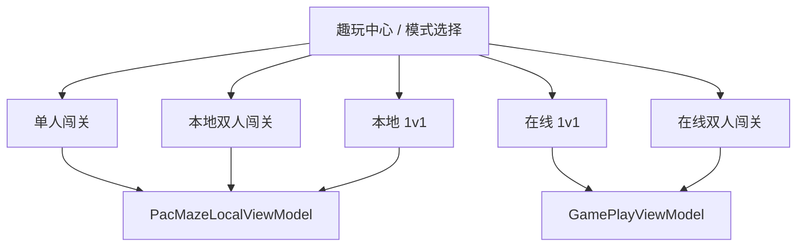
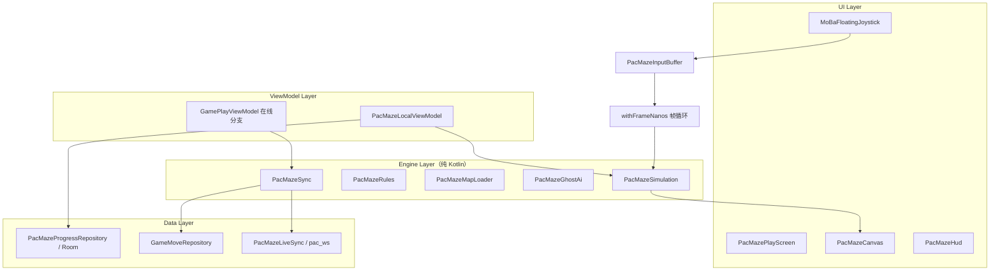
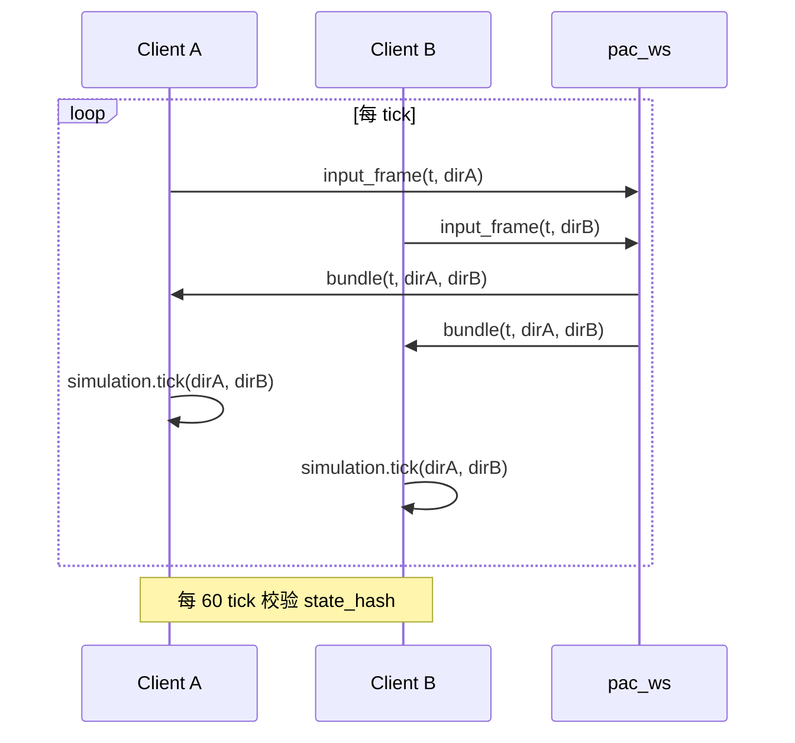

# 豆人迷宫（Pac-Maze）· 企业级开发文档

> **文档性质：** 可执行开发规格（设计 + 实现指引）  
> **项目根目录：** `D:\soft`（FunLife Android App）  
> **游戏 ID：** `pac_maze`（在线）/ `pac_maze_local`（本地同屏）  
> **UI 范式：** 王者荣耀式全屏浮层摇杆（非侧边控制栏）  
> **版本：** v1.0 · 2026-06-08  
> **前置阅读：** `DEVELOPMENT_PRINCIPLES.md`、`docs/social_games_and_gifts_design.md`

**关联文档：**

| 文档 | 关系 |
|------|------|
| `DEVELOPMENT_PRINCIPLES.md` | 全局开发原则（userId 隔离、崩溃防御等） |
| `docs/social_games_and_gifts_design.md` | 趣玩中心、房间协议、Catalog 设计 |
| `.claude/docs/draw-guess-speech-bubble-implementation.md` | 你画我猜 UI 参考 |
| `pocketbase/tools/draw_ws/README.md` | 实时 WS 热路径参考（在线模式二期） |

---

## 目录

1. [文档目标与范围](#一文档目标与范围)
2. [开发原则（必读）](#二开发原则必读)
3. [项目背景与现有架构](#三项目背景与现有架构)
4. [你画我猜模块摘要与性能教训](#四你画我猜模块摘要与性能教训)
5. [产品定义：豆人迷宫](#五产品定义豆人迷宫)
6. [UI 规范：王者荣耀式浮层布局](#六ui-规范王者荣耀式浮层布局)
7. [技术架构](#七技术架构)
8. [游戏引擎设计](#八游戏引擎设计)
9. [关卡系统设计](#九关卡系统设计)
10. [多人同步方案](#十多人同步方案)
11. [数据模型与协议](#十一数据模型与协议)
12. [PocketBase 改造](#十二pocketbase-改造)
13. [目录结构与文件清单](#十三目录结构与文件清单)
14. [分阶段实施计划](#十四分阶段实施计划)
15. [测试与验收](#十五测试与验收)
16. [风险与合规](#十六风险与合规)
17. [提交前 Checklist](#十七提交前-checklist)

---

## 一、文档目标与范围

### 1.1 本文档解决什么问题

本文档汇总以下讨论结论，形成 **可直接开工** 的开发规格：

| 来源 | 内容 |
|------|------|
| 项目调研 | FunLife 趣玩中心、你画我猜、五子棋的集成方式 |
| 性能分析 | 你画我猜画笔卡顿根因 → 豆人迷宫必须规避的反模式 |
| 产品需求 | 单人、双人、双人闯关、1v1 对战、关卡设计 |
| UI 需求 | 手机横屏 + **王者荣耀式左下浮层摇杆**（非侧边栏） |

### 1.2 交付范围

| 阶段 | 范围 | 网络 |
|------|------|------|
| **Phase 1（MVP）** | 本地单人闯关 + 横屏浮层摇杆 + 5 关 | 无 |
| **Phase 2** | 本地双人同屏 / 本地 1v1 | 无 |
| **Phase 3** | 在线 1v1 对战 | PocketBase + pac_ws |
| **Phase 4** | 在线双人闯关 | 同上 |
| **Phase 5（可选）** | 关卡编辑器 / UGC | PocketBase 扩展 |

### 1.3 非目标（本期不做）

- 陌生人匹配 / 全服排行榜 / 排位赛
- 3 人以上同局
- 1:1 复刻 Namco 官方素材与「Pac-Man」商标
- 语音 / 视频
- 把 VIP / 金币主数据迁入 PocketBase

---

## 二、开发原则（必读）

> **原则层级：** 全局原则（`DEVELOPMENT_PRINCIPLES.md`）> 社交游戏原则 > 豆人迷宫专项原则。冲突时以上级为准。

### 2.1 全局原则（继承自 `DEVELOPMENT_PRINCIPLES.md`）

| # | 原则 | 豆人迷宫落地要求 |
|---|------|------------------|
| G-1 | **userId 显式传递，禁止默认值** | `PacMazeProgressRepository` 所有 DAO 带 `userId: Long`，无默认值 |
| G-2 | **ViewModel 构造参数接收 currentUserId** | `PacMazeLocalViewModel(currentUserId)`，禁止 init 内冻结 |
| G-3 | **NavGraph 实例化加 userId key** | `viewModel(key = "pac_maze_${userId}")` |
| G-4 | **SharedPreferences / 文件按 userId 命名** | 进度 key：`pac_maze_progress_${userId}` |
| G-5 | **Canvas 几何防御** | `radius`、`strokeWidth` 必须 `coerceAtLeast(1f)` |
| G-6 | **Room 变更必须 Migration** | `PacMazeProgressEntity` 增删字段写迁移 |
| G-7 | **生产日志不泄漏 token** | 在线模式 OkHttp `Level.NONE`，redact Authorization |

### 2.2 社交游戏集成原则

| # | 原则 | 说明 |
|---|------|------|
| S-1 | **Catalog 驱动入口** | 在 `SocialGameCatalog.kt` 注册，不写死游戏列表 |
| S-2 | **模式存 game_state，非 Catalog** | `game_state.pac_maze.mode` 区分 solo / coop / versus |
| S-3 | **引擎纯函数、可测试** | 规则放 `engine/`，UI 不含碰撞/得分逻辑 |
| S-4 | **本地与在线 ViewModel 分离** | 本地用 `PacMazeLocalViewModel`，不膨胀 `GamePlayViewModel` |
| S-5 | **复用房间链路** | 在线模式：Center → Detail → Lobby → Play，与五子棋一致 |
| S-6 | **Move 账本权威** | 结算、重连、回放以 `game_moves` 为准（在线模式） |

### 2.3 实时游戏性能原则（来自你画我猜教训）

| # | 原则 | 反模式（禁止） |
|---|------|----------------|
| P-1 | **输入 / 渲染 / 网络三线程分离** | 每帧 pointer move → `publishUi` → 全树 recompose |
| P-2 | **本地墨水不进全局 StateFlow** | 当前 tick 状态写入 `GamePlayUiState` 每 4ms |
| P-3 | **帧循环 VSYNC 对齐** | 在 `onDrag` 内直接改 UI state 并 redraw 全量 Path |
| P-4 | **静态层 bitmap 缓存** | 每帧从零 `Path()` 重建全部关卡 + 全部豆子 |
| P-5 | **输入环形缓冲** | 同步阻塞主线程等网络回包再移动 |
| P-6 | **HUD 与 Canvas 分层** | 分数变化触发迷宫 Canvas 重绘 |

### 2.4 豆人迷宫 UI 原则（王者荣耀式）

| # | 原则 | 说明 |
|---|------|------|
| U-1 | **全屏游戏 + 浮层控件** | Canvas `fillMaxSize()`，摇杆/按钮 `Box` 叠层 |
| U-2 | **禁止侧边固定控制栏** | 不可用 70/30 分屏挤占地图 |
| U-3 | **左摇杆、右动作键** | 与 MOBA 肌肉记忆一致 |
| U-4 | **横屏专用** | 进入游戏页锁 `sensorLandscape`，退出恢复 |
| U-5 | **半透明待机、触摸高亮** | 摇杆 idle 35% opacity，active 75% |
| U-6 | **安全区适配** | `statusBarsPadding` + `navigationBarsPadding` + 挖孔 inset |

### 2.5 代码风格原则

| # | 原则 |
|---|------|
| C-1 | 最小 diff：不改动与豆人迷宫无关模块 |
| C-2 | 匹配现有命名：`PacMazeXxx` 对齐 `DrawGuessXxx` / `GomokuXxx` |
| C-3 | 注释只写非 obvious 业务逻辑（如 lockstep 缓冲策略） |
| C-4 | 先写 engine 单元测试，再写 UI |

---

## 三、项目背景与现有架构

### 3.1 FunLife 技术栈

| 层级 | 技术 |
|------|------|
| 客户端 | Kotlin + Jetpack Compose + Material3 |
| 架构 | MVVM（ViewModel + StateFlow）+ Repository |
| 本地 DB | Room |
| 后端 | PocketBase（REST + Realtime SSE） |
| 实时绘画 WS | `draw_ws`（8790 端口，仅你画我猜） |

### 3.2 社交游戏导航流

```
趣玩中心 SocialGameCenterScreen
    → 游戏详情 GameDetailScreen
        → 大厅 GameLobbyScreen（在线）
            → 对局 GamePlayScreen
本地游戏：Catalog.localRoute 直达（如 dice_game）
```

**路由定义：** `app/src/main/java/com/example/funlife/navigation/NavGraph.kt`

### 3.3 现有 LIVE 游戏

| gameId | 名称 | 同步模式 | 参考用途 |
|--------|------|----------|----------|
| `gomoku` | 五子棋 | Move 账本 + SSE | 在线房间、乐观更新 |
| `draw_guess` | 你画我猜 | WS 热路径 + PB 冷路径 | 高频实时（反例教训） |
| `dice_game` | 骰子派对 | 本地同屏 | LOCAL_PARTY 入口 |

### 3.4 可复用基础设施

| 组件 | 路径 | 豆人迷宫用途 |
|------|------|--------------|
| SocialGameCatalog | `social/game/catalog/SocialGameCatalog.kt` | 注册游戏 |
| GameRoomRepository | `repository/GameRoomRepository.kt` | 在线开房 |
| GamePlaySyncManager | `social/game/GamePlaySyncManager.kt` | SSE + 轮询 |
| GameMoveRepository | `repository/GameMoveRepository.kt` | Move 提交 |
| PlayStateFactory | `social/game/model/PlayStateFactory.kt` | 开局初始化 game_state |
| draw_ws | `pocketbase/tools/draw_ws/` | fork 为 pac_ws（Phase 3） |

---

## 四、你画我猜模块摘要与性能教训

> **目的：** 理解现有最复杂游戏的架构，并明确豆人迷宫必须规避的问题。

### 4.1 你画我猜架构摘要

```
DrawGuessPlayPanel（Canvas + pointerInput）
    → GamePlayViewModel.submitDrawStrokeLive()
        → DrawGuessLiveSync.sendChunk()（WS ~4ms）
        → pendingDrawStrokes + publishUi()（每 chunk）
    → resolveDrawStrokesForUi() = 账本 + pending + WS 三层合并
```

**关键文件：**

| 文件 | 职责 |
|------|------|
| `ui/.../DrawGuessPlayPanel.kt` | 画布、手势、本地 preview |
| `viewmodel/GamePlayViewModel.kt` | 状态、同步、bootstrap |
| `social/drawws/DrawGuessLiveSync.kt` | WS 热路径 |
| `social/game/engine/DrawGuessSync.kt` | 账本 stroke 合并 |

### 4.2 画笔卡顿根因（豆人迷宫必须规避）

| 优先级 | 根因 | 现象 |
|--------|------|------|
| 🔴 P0 | 每 ~4ms `publishUi(drawStrokes)` | 全屏 recompose ~250 次/秒 |
| 🔴 P0 | `localPath` + `pendingDrawStrokes` 双绘 | 粗细跳动、重影 |
| 🟠 P1 | 每帧全量 `Path()` 重建 | 笔画越多越卡 |
| 🟠 P1 | 画家侧无 VSYNC 帧循环 | 视觉上「一段一段」 |
| 🟡 P2 | `pointerInput` key 含 `brush` | 换笔刷中断手势 |

### 4.3 豆人迷宫对应策略

| 你画我猜问题 | 豆人迷宫做法 |
|--------------|--------------|
| chunk → publishUi | tick 内只写本地 buffer；HUD 低频更新 |
| 全量 Path 重绘 | 静态墙/豆 bitmap 缓存 + 动态 sprite |
| 输入绑 ViewModel | `PacMazeInputBuffer` + `withFrameNanos` |
| WS + UI 同路径 | 在线模式：输入走 pac_ws，UI 不等待网络 |

---

## 五、产品定义：豆人迷宫

### 5.1 品牌与合规

- **对外名称：** 「豆人迷宫」或「迷宫豆人」
- **内部 gameId：** `pac_maze` / `pac_maze_local`
- **素材：** 自研像素风，不使用 Namco 官方角色/音效/名称
- **玩法：** 经典迷宫吃豆、能量豆、幽灵、穿屏隧道

### 5.2 游戏模式矩阵



| 模式 | mode 值 | 人数 | 入口 | Phase |
|------|---------|------|------|-------|
| 单人闯关 | `solo` | 1 | LOCAL_PARTY | 1 |
| 本地双人闯关 | `local_coop` | 2 同屏 | LOCAL_PARTY | 2 |
| 本地 1v1 | `local_versus` | 2 同屏 | LOCAL_PARTY | 2 |
| 在线 1v1 | `online_versus` | 2 跨设备 | ONLINE_PVP | 3 |
| 在线双人闯关 | `online_coop` | 2 跨设备 | ONLINE_PVP | 4 |

### 5.3 各模式规则摘要

#### 单人闯关（Phase 1）

- 经典关卡递进：清豆 → 开门 → 下一关
- 初始 3 命；能量豆短暂反杀幽灵
- 本地 Room 存档：最高关、最高分、星级

#### 本地双人闯关（Phase 2）

- 同屏两豆人；共享或独立命数（可配置，默认共享 5 命）
- 左半屏 P1 摇杆 + 右半屏 P2 摇杆（各在各自半屏左下角，王者荣耀握法）

#### 本地 1v1（Phase 2）

- P1 豆人 vs P2 控幽灵（无 AI 幽灵）
- 计分：豆人吃豆得分 vs 幽灵抓人次数

#### 在线 1v1（Phase 3）

- 非对称：seat0 豆人 / seat1 幽灵，或竞速吃豆（同图比分数）
- 同步：确定性 lockstep（见第十章）

#### 在线双人闯关（Phase 4）

- 共用关卡进度；lockstep 双输入
- 过关条件：清豆 + 至少一人生还

### 5.4 Catalog 注册（草案）

```kotlin
// 在线版 — Phase 3 启用，Phase 1 可 COMING_SOON
SocialGameEntry(
    gameId = "pac_maze",
    title = "豆人迷宫",
    subtitle = "经典迷宫，好友对战 / 联机闯关",
    iconEmoji = "👾",
    category = GameCategory.ONLINE_PVP,
    playersLabel = "1~2 人",
    minPlayers = 1,
    maxPlayers = 2,
    status = GameCatalogStatus.BETA,
    minPocketBase = true,
    sortOrder = 4,
    tags = listOf("街机", "横屏"),
    durationLabel = "约 3~10 分钟",
),

// 本地版 — Phase 1 启用
SocialGameEntry(
    gameId = "pac_maze_local",
    title = "豆人迷宫 · 单机",
    subtitle = "单人闯关，随时开玩",
    iconEmoji = "👾",
    category = GameCategory.LOCAL_PARTY,
    playersLabel = "1~2 人同屏",
    localRoute = "pac_maze",
    status = GameCatalogStatus.LIVE,
    sortOrder = 22,
    tags = listOf("街机", "横屏", "同屏"),
    durationLabel = "随时开玩",
),
```

---

## 六、UI 规范：王者荣耀式浮层布局

### 6.1 布局总览

```
┌─────────────────────────────────────────────────────────────┐
│  [≡]    Level 3    ♥♥♥    12,400    ⏱ 02:15    [🔊]       │  ← Layer 1: 顶栏 HUD
│                                                             │
│                                                             │
│              Layer 0: 全屏迷宫 Canvas（100%）                 │
│              居中 letterbox，保持格子宽高比                    │
│                                                             │
│   ┌──────┐                                    ┌───┐ ┌───┐  │
│   │ ◎    │                                    │ ⚡ │ │ ⏸ │  │
│   │摇杆  │                                    └───┘ └───┘  │
│   └──────┘                                                   │
│   Layer 2: 左下浮层摇杆          Layer 3: 右下动作键           │
└─────────────────────────────────────────────────────────────┘
```

### 6.2 Compose 层级结构

```kotlin
@Composable
fun PacMazePlayScreen(...) {
    LockLandscape()  // DisposableEffect 锁横屏

    Box(Modifier.fillMaxSize().background(Color.Black)) {

        // Layer 0 — 全屏游戏（不被挤占）
        PacMazeCanvas(
            modifier = Modifier.fillMaxSize(),
            world = worldState,
        )

        // Layer 1 — 顶栏 HUD
        PacMazeHud(
            modifier = Modifier
                .align(Alignment.TopCenter)
                .fillMaxWidth()
                .statusBarsPadding(),
            level = ..., score = ..., lives = ..., timer = ...,
        )

        // Layer 2 — 左下浮层摇杆（王者荣耀式）
        MoBaFloatingJoystick(
            modifier = Modifier
                .align(Alignment.BottomStart)
                .padding(start = 40.dp, bottom = 32.dp)
                .navigationBarsPadding(),
            config = JoystickConfig(
                outerRadius = 72.dp,
                innerRadius = 28.dp,
                deadZone = 0.12f,
                idleAlpha = 0.35f,
                activeAlpha = 0.75f,
                dynamicBase = true,  // 按下时底座可跟随拇指（可选）
            ),
            onDirection = { dir -> inputBuffer.push(playerId, dir) },
        )

        // Layer 3 — 右下动作键
        PacMazeActionCluster(
            modifier = Modifier
                .align(Alignment.BottomEnd)
                .padding(end = 40.dp, bottom = 32.dp)
                .navigationBarsPadding(),
            onPause = ..., onBoost = ...,  // Boost 二期
        )
    }
}
```

### 6.3 摇杆行为规范（MoBaFloatingJoystick）

| 行为 | 规格 |
|------|------|
| 外圈 | 固定或动态（按下时移至触点） |
| 内圈 | 跟随拇指，超出外半径 clamp |
| 死区 | 12%，区内输出 `null`（STOP） |
| 方向量化 | 四象限 → UP / DOWN / LEFT / RIGHT |
| 松手 | 内圈回中，方向 STOP |
| 事件消费 | 摇杆区域 `pointerInput` consume，不穿透 |
| 输出 | 写入 `PacMazeInputBuffer`，**不**直接改 ViewModel State |

### 6.4 摇杆参数表

| 参数 | 值 | 说明 |
|------|-----|------|
| outerRadius | 72.dp | 外圈半径 |
| innerRadius | 28.dp | 内圈拖块 |
| deadZone | 0.12f | 归一化死区 |
| idleAlpha | 0.35f | 未触摸透明度 |
| activeAlpha | 0.75f | 触摸透明度 |
| padding | start/bottom 32~40.dp | 拇指热区 |

### 6.5 本地双人布局

| 模式 | 布局 |
|------|------|
| 同屏协作 / 1v1 | 屏幕左右各 50%；P1 摇杆在左半屏左下角，P2 在右半屏左下角 |
| 分屏线 | 可选 1dp 竖线分隔 |
| 各自 HUD | 半屏顶部显示对应玩家分数/命数 |

### 6.6 横屏锁定

```kotlin
@Composable
fun LockLandscape() {
    val context = LocalContext.current
    DisposableEffect(Unit) {
        val activity = context.findActivity()
        val original = activity?.requestedOrientation
        activity?.requestedOrientation = ActivityInfo.SCREEN_ORIENTATION_SENSOR_LANDSCAPE
        onDispose {
            activity?.requestedOrientation =
                original ?: ActivityInfo.SCREEN_ORIENTATION_UNSPECIFIED
        }
    }
}
```

**Manifest（推荐）：** 若独立 Activity，声明 `android:screenOrientation="sensorLandscape"`。

### 6.7 禁止项（UI 评审）

- ❌ 右侧 30% 固定控制栏
- ❌ 摇杆嵌入 `Row` 与 Canvas 平分宽度
- ❌ 每帧因分数变化重绘整个迷宫 bitmap
- ❌ 竖屏布局作为主模式

---

## 七、技术架构

### 7.1 分层图



### 7.2 本地 vs 在线路径

| 路径 | ViewModel | 帧循环 | 网络 |
|------|-----------|--------|------|
| 本地 | `PacMazeLocalViewModel` | 设备端 60 tick/s | 无 |
| 在线 | `GamePlayViewModel` + `PacMazePlayPanel` | Lockstep 30~60 tick/s | pac_ws + PB |

### 7.3 输入 / 渲染 / 网络分离（强制）

```
┌─────────────┐     ┌─────────────┐     ┌─────────────┐
│  Input      │     │  Render     │     │  Network    │
│  摇杆/触摸   │ ──► │  FrameLoop  │     │  pac_ws     │
│  RingBuffer │     │  Simulation │     │  Dispatchers│
│             │     │  Canvas     │     │  .IO        │
└─────────────┘     └─────────────┘     └─────────────┘
       │                    ▲                   │
       │                    │                   │
       └──── 每帧 drain ────┘                   │
       └──────── 仅方向变更 ──────────────────────┘
                         （不阻塞 Render）
```

---

## 八、游戏引擎设计

### 8.1 核心常量

```kotlin
object PacMazeConstants {
    const val TICKS_PER_SECOND = 60
    const val TILE_SIZE = 16          // 逻辑像素，渲染时 scale
    const val DEFAULT_MAP_WIDTH = 28
    const val DEFAULT_MAP_HEIGHT = 31
    const val INITIAL_LIVES = 3
    const val POWER_DURATION_TICKS = 300  // 5s @ 60fps
}
```

### 8.2 实体与状态

```kotlin
enum class Direction { UP, DOWN, LEFT, RIGHT }

enum class TileType(val code: Int) {
    WALL(0), PATH(1), PELLET(2), POWER(3), DOOR(4), TUNNEL(5)
}

enum class GhostMode { CHASE, SCATTER, FRIGHTENED, EATEN }

data class PacMazeEntity(
    val id: String,
    val role: String,       // pac | ghost
    val x: Float,           // 格子坐标（可小数，插值用）
    val y: Float,
    val direction: Direction?,
    val speed: Float,
)

data class PacMazeWorldState(
    val tick: Long,
    val levelId: Int,
    val tiles: IntArray,            // width * height
    val entities: List<PacMazeEntity>,
    val scores: Map<String, Int>,
    val lives: Int,
    val pelletsRemaining: Int,
    val phase: String,              // playing | level_clear | game_over | paused
    val rngSeed: Long,
    val powerTicksLeft: Int = 0,
)
```

### 8.3 仿真单步（纯函数）

```kotlin
object PacMazeSimulation {
    fun tick(
        state: PacMazeWorldState,
        inputs: Map<String, Direction?>,
        config: PacMazeLevelConfig,
    ): PacMazeWorldState {
        // 1. 应用输入（网格转向：仅交叉口可换向）
        // 2. 移动实体
        // 3. 碰撞：豆、能量豆、幽灵、隧道
        // 4. Ghost AI（单人 / AI 模式）
        // 5. 判定 level_clear / death / game_over
        return newState
    }
}
```

**原则：** `PacMazeSimulation` 无副作用，可单元测试；禁止访问 Android API。

### 8.4 渲染策略

| 层 | 内容 | 更新频率 |
|----|------|----------|
| 静态层 `ImageBitmap` | 墙、豆（吃豆后局部 invalidate） | 关卡加载 / 吃豆时 |
| 动态层 | 豆人、幽灵 sprite | 每帧 |
| HUD | 分数、命、计时 | 分数变化时（≤ 10Hz） |

```kotlin
// 帧循环伪代码 — 遵守 P-1 ~ P-6
LaunchedEffect(gameSessionId) {
    while (isActive) {
        withFrameNanos { _ ->
            val inputs = inputBuffer.drain()
            worldState = PacMazeSimulation.tick(worldState, inputs, levelConfig)
            // 只 invalidate 动态层；静态 bitmap 不重绘
            dynamicLayer.invalidate(worldState.entities)
        }
    }
}
```

### 8.5 幽灵 AI（单人模式）

| 模式 | 行为 |
|------|------|
| CHASE | 目标：豆人位置（A* 或曼哈顿） |
| SCATTER | 目标：各自角落 |
| FRIGHTENED | 随机方向，降速 |
| EATEN | 回幽灵房 |

1v1 模式下 P2 控幽灵，关闭 AI。

---

## 九、关卡系统设计

### 9.1 关卡 JSON 格式

**路径：** `app/src/main/assets/pac_maze/levels/level_001.json`

```json
{
  "id": 1,
  "name": "Classic-1",
  "width": 28,
  "height": 31,
  "tiles_rle": "0:120,1:45,2:1,...",
  "spawn": {
    "pac": [14, 23],
    "pac2": [13, 23],
    "ghosts": [[13, 11], [14, 11], [15, 11], [16, 11]],
    "ghost_door_y": 14
  },
  "pellets": 244,
  "power_pellets": [[1, 3], [26, 3], [1, 23], [26, 23]],
  "fruit_schedule_ticks": [420, 1020],
  "difficulty": {
    "ghost_speed_mul": 1.0,
    "ai_aggression": 0.8
  }
}
```

### 9.2 关卡递进

| 阶段 | 关卡 ID | 机制 |
|------|---------|------|
| 教学 | 1–3 | 小地图、1~2 幽灵 |
| 经典 | 4–10 | 标准 28×31、AI 加速 |
| 进阶 | 11–15 | 复杂隧道 |
| 挑战 | 16–20 | 限时 / 迷雾（可选） |
| 无尽 | procedural | `levelSeed` 随机可复现 |

### 9.3 进度存储（Room）

```kotlin
@Entity(
    tableName = "pac_maze_progress",
    indices = [Index("userId")],
)
data class PacMazeProgressEntity(
    @PrimaryKey(autoGenerate = true) val id: Long = 0,
    val userId: Long,              // 无默认值 — 遵守 G-1
    val maxLevelReached: Int,
    val highScore: Int,
    val starsBitmask: Int,
    val updatedAt: Long,
)
```

---

## 十、多人同步方案

### 10.1 模式选型

| 模式 | 同步方案 | 原因 |
|------|----------|------|
| 本地全部 | 无网络 | 零延迟 |
| 在线 1v1 / 联机 | 确定性 Lockstep + pac_ws | 实时；PB 仅存档/结算 |
| 不推荐 | 每 tick POST game_moves | HTTP 延迟 100ms+，无法玩 |

### 10.2 Lockstep 流程



### 10.3 关键参数

| 参数 | 值 | 说明 |
|------|-----|------|
| logicTickRate | 60 / 30 | 可配置降级 |
| inputBufferFrames | 2~3 | 等待对手输入 |
| hashCheckInterval | 60 ticks | 不一致则 resync |
| pac_ws coalesce | 16ms | 合并同 tick 输入 |

### 10.4 降级

| 级别 | 条件 | 行为 |
|------|------|------|
| L0 | WS 正常 | Lockstep |
| L1 | WS 断 | PB 轮询 15 tick/s |
| L2 | 丢包严重 | 暂停 + 重连 UI |
| L3 | 不可恢复 | 判负 / 平局，写 move 结算 |

### 10.5 pac_ws（Phase 3）

**路径：** `pocketbase/tools/pac_ws/`（fork `draw_ws` 结构）

| 消息 | 方向 | 内容 |
|------|------|------|
| `input_frame` | C→S | tick, player, direction |
| `frame_bundle` | S→C | tick, inputs[] |
| `state_hash` | C→S | tick, hash |
| `resync_snapshot` | S→C | 完整 world snapshot |

---

## 十一、数据模型与协议

### 11.1 game_state.pac_maze

```kotlin
data class PacMazePlayState(
    val mode: String,
    val levelId: Int,
    val levelSeed: Long,
    val phase: String,
    val scores: Map<String, Int>,
    val lives: Int,
    val sharedLives: Int?,
    val roles: Map<String, String>,
    val tick: Long,
    val rngSeed: Long,
    val phaseStartedAtMs: Long = 0L,
)
```

### 11.2 game_moves.payload

| kind | 字段 | 用途 |
|------|------|------|
| `pac_input` | tick, dir, role | 输入存档（审计） |
| `pac_level_clear` | level_id, score | 过关 |
| `pac_game_over` | winner_pb_id, reason | 结算 |
| `pac_pause` | paused: bool | 暂停（可选） |

示例：

```json
{ "kind": "pac_input", "tick": 1024, "dir": "left", "role": "pac" }
{ "kind": "pac_game_over", "winner_pb_id": "abc123", "reason": "score" }
```

### 11.3 GamePlayUiState 扩展（在线）

```kotlin
// GamePlayUiState 新增字段
val pacMaze: PacMazePlayState? = null,
// 注意：实时 worldState 不放 UiState，放 ViewModel 私有字段
```

---

## 十二、PocketBase 改造

### 12.1 Migration

- `game_type` select 增加 `pac_maze`
- 可选：`pac_maze_levels` 集合（Phase 5 UGC）

### 12.2 Hooks（main.pb.js）

| 函数 | 职责 |
|------|------|
| `applyPacMazeInputOnRoom` | 校验 tick 单调、角色合法 |
| `applyPacMazeLevelEnd` | 更新 level_id、scores |
| `applyPacMazeGameOver` | 写 winner、status=finished |
| `verifyPacMazeStateHash` | 防作弊抽检 |

### 12.3 E2E 测试

**路径：** `pocketbase/tools/test_pac_maze_sync_e2e.js`（仿 `test_game_gomoku_move_e2e.js`）

---

## 十三、目录结构与文件清单

```
app/src/main/java/com/example/funlife/
├── social/game/
│   ├── catalog/SocialGameCatalog.kt                 [MOD] 注册
│   ├── model/
│   │   ├── PacMazePlayState.kt                      [NEW]
│   │   ├── PacMazeMoveModels.kt                     [NEW]
│   │   └── GameRoomStateCodec.kt                    [MOD] pac_maze 字段
│   ├── engine/
│   │   ├── PacMazeSimulation.kt                     [NEW]
│   │   ├── PacMazeRules.kt                          [NEW]
│   │   ├── PacMazeMapLoader.kt                      [NEW]
│   │   ├── PacMazeGhostAi.kt                        [NEW]
│   │   ├── PacMazeSync.kt                           [NEW]
│   │   └── PacMazeDeterministicRng.kt               [NEW]
│   └── pacws/                                       [NEW] Phase 3
│       ├── PacMazeLiveSync.kt
│       ├── PacWsSession.kt
│       └── PacWsBinaryCodec.kt
├── ui/screens/pacmaze/
│   ├── PacMazeModeSelectScreen.kt                   [NEW]
│   ├── PacMazeLocalPlayScreen.kt                    [NEW]
│   └── components/
│       ├── PacMazeCanvas.kt                         [NEW]
│       ├── MoBaFloatingJoystick.kt                  [NEW]
│       ├── PacMazeHud.kt                            [NEW]
│       ├── PacMazeActionCluster.kt                  [NEW]
│       ├── LockLandscape.kt                         [NEW]
│       └── PacMazePlayPanel.kt                      [NEW] Phase 3 在线
├── viewmodel/
│   ├── PacMazeLocalViewModel.kt                     [NEW]
│   └── GamePlayViewModel.kt                         [MOD] 在线分支
├── repository/
│   └── PacMazeProgressRepository.kt                 [NEW]
├── navigation/NavGraph.kt                           [MOD] pac_maze 路由
└── data/entity/PacMazeProgressEntity.kt             [NEW]

app/src/main/assets/pac_maze/
├── levels/level_001.json ... level_020.json           [NEW]
└── sprites/                                           [NEW]

app/src/test/.../engine/
├── PacMazeSimulationTest.kt                           [NEW]
└── PacMazeSyncTest.kt                                 [NEW]

pocketbase/
├── pb_migrations/xxx_add_pac_maze.js                  [NEW] Phase 3
├── pb_hooks/main.pb.js                                [MOD]
└── tools/pac_ws/                                      [NEW] Phase 3
```

---

## 十四、分阶段实施计划

### Phase 1 — 本地单人 MVP（3~4 周）

| 任务 | 产出 | 验收 |
|------|------|------|
| Engine 骨架 | Simulation + 5 关 | 单元测试通过 |
| MoBaFloatingJoystick | 浮层摇杆 | 四向响应 < 50ms |
| PacMazeLocalPlayScreen | 全屏 Box 布局 | 横屏稳定 |
| 帧循环 | withFrameNanos 60fps | Systrace 主线程 < 8ms |
| Room 进度 | maxLevel, highScore | userId 隔离 |
| Catalog + Nav | localRoute 入口 | 趣玩中心可进 |

### Phase 2 — 本地双人（2 周）

| 任务 | 产出 |
|------|------|
| 双摇杆布局 | 左右半屏各一 |
| local_coop / local_versus | 模式选择页 |
| 15 关 | 关卡包扩展 |

### Phase 3 — 在线 1v1（3~4 周）

| 任务 | 产出 |
|------|------|
| pac_ws | input_frame 广播 |
| Lockstep | 双端 state_hash 一致 |
| GamePlayScreen 分支 | PacMazePlayPanel |
| PB hooks + E2E | test_pac_maze_sync_e2e.js |

### Phase 4 — 在线双人闯关（2~3 周）

| 任务 | 产出 |
|------|------|
| online_coop 模式 | 共享命/进度 |
| 5 关联机专用图 | co-op 设计 |

### Phase 5 — 关卡编辑器（可选）

| 任务 | 产出 |
|------|------|
| Tile 编辑器 DEBUG | 导出 JSON |
| UGC 上传 | pac_maze_levels 集合 |

---

## 十五、测试与验收

### 15.1 单元测试

| 测试类 | 覆盖 |
|--------|------|
| PacMazeSimulationTest | 碰撞、吃豆、死亡、过关 |
| PacMazeSyncTest | 同输入序列 → 同 hash |
| PacMazeMapLoaderTest | RLE 解码、边界 |

### 15.2 UI / 性能测试

| 项 | 标准 |
|----|------|
| 帧率 | 中高端机 ≥ 55 fps；低端 ≥ 30 fps |
| 摇杆延迟 | 触碰到方向生效 < 50ms |
| Recomposition | 拖动摇杆时 Canvas composable 不应因 HUD 抖动 |
| 内存 | 静态 bitmap 单关 < 4MB |

### 15.3 在线测试

- 两模拟器 / 两真机：1v1 完整流程
- 断网 5s 恢复：降级 L1→L0
- hash 不一致：触发 resync

### 15.4 Phase 1 验收清单

- [ ] 趣玩中心 → 豆人迷宫 · 单机 → 进入横屏
- [ ] 左下浮层摇杆可控四向
- [ ] 5 关可通关，命数/得分正确
- [ ] 退出重进进度保留（按 userId）
- [ ] 切换账号进度隔离
- [ ] `./gradlew :app:compileDebugKotlin` 通过

---

## 十六、风险与合规

| 风险 | 等级 | 对策 |
|------|------|------|
| 商标 / 版权 | 高 | 自研素材，不用 Pac-Man 名称 |
| 在线 sync 复杂度 | 中 | Phase 1 仅本地，验证玩法后再做 |
| GamePlayViewModel 膨胀 | 中 | 本地独立 ViewModel |
| 横屏影响其他页面 | 低 | DisposableEffect / 独立 Activity |
| Lockstep 作弊 | 中 | state_hash + PB 抽检 |
| 低端机性能 | 中 | 30 tick + 静态 bitmap |

---

## 十七、提交前 Checklist

### 17.1 全局（来自 DEVELOPMENT_PRINCIPLES.md）

- [ ] DAO / Repository 的 `userId` 无默认值
- [ ] ViewModel 构造参数接收 `currentUserId`
- [ ] NavGraph `viewModel(key = "pac_maze_${userId}")`
- [ ] SharedPreferences / 文件路径含 userId
- [ ] Room 变更已写 Migration
- [ ] 日志无 token / 密码
- [ ] Canvas `radius` / `size` 已 `coerceAtLeast(1f)`

### 17.2 性能（来自第四章教训）

- [ ] 帧循环使用 `withFrameNanos`，非 `delay` 驱动仿真
- [ ] 摇杆输出进 InputBuffer，非直接 `publishUi`
- [ ] 静态迷宫 bitmap 缓存
- [ ] 在线 worldState 不在 `GamePlayUiState` 每 tick 更新

### 17.3 UI（王者荣耀式）

- [ ] Canvas 全屏 `fillMaxSize`
- [ ] 摇杆 `align(BottomStart)` 浮层
- [ ] 无右侧固定控制栏
- [ ] 横屏锁定 / 退出恢复

### 17.4 社交游戏

- [ ] Catalog 已注册
- [ ] 模式写入 `game_state.pac_maze.mode`（在线）
- [ ] Engine 无 Android 依赖
- [ ] 单元测试通过

---

## 附录 A：与你画我猜的对比

| 维度 | 你画我猜 | 豆人迷宫 |
|------|----------|----------|
| 同步频率 | ~250 chunk/s | 60 tick/s 本地；在线 input only |
| 状态类型 | 矢量 stroke 点阵 | 网格实体 + tick |
| UI 更新 | 每 chunk publishUi ❌ | 帧循环 + HUD 低频 ✅ |
| 渲染 | 全量 Path 重建 ❌ | 静态 bitmap + sprite ✅ |
| 控件 | 手指直接画 | 王者荣耀浮层摇杆 ✅ |
| 在线通道 | draw_ws | pac_ws（Phase 3） |

---

## 附录 B：术语表

| 术语 | 含义 |
|------|------|
| Lockstep | 双方仅同步输入，同 seed 同逻辑推演 |
| MoBa 布局 | Mobile MOBA 布局：左摇杆右技能，全屏游戏 |
| RLE | Run-Length Encoding，关卡 tiles 压缩 |
| state_hash | 世界状态哈希，用于同步校验 |
| LOCAL_PARTY | Catalog 分类：本地同屏，无需 PocketBase 房间 |
| ONLINE_PVP | Catalog 分类：在线房间对战 |

---

**文档维护：** 每完成一个 Phase，更新对应章节状态与 Checklist。  
**最后一句话原则（性能）：** *「如果你不能指出一帧里是哪一层在重绘，那一帧就有优化空间。」*
