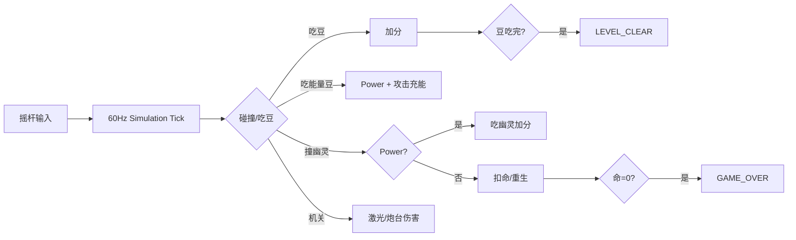
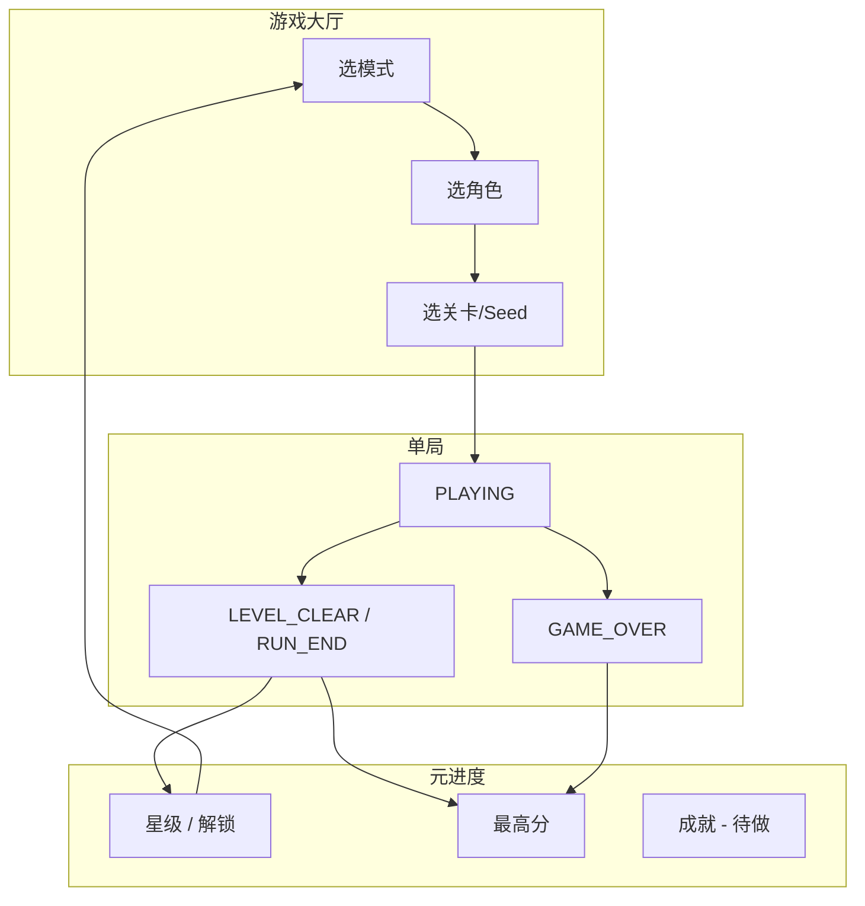

# 豆人迷宫（Pac-Maze）· 游戏系统设计规格书

> **文档性质：** 企业级产品 + 系统设计（Game System Design, GSD）  
> **读者：** 产品、客户端、服务端、QA、运营  
> **关联实现文档：** `[pac_maze_development_guide.md](./pac_maze_development_guide.md)`（工程落地、目录、Phase 计划）  
> **版本：** v1.0 · 2026-06-09  
> **当前基线：** 单人闯关 13 关可玩；本地双人 / 1v1 / 在线为占位

---

## 文档控制


| 项      | 内容                                                   |
| ------ | ---------------------------------------------------- |
| 游戏 ID  | `pac_maze`（在线入口）/ `pac_maze_local`（本地）               |
| 引擎包    | `com.example.funlife.social.game.engine.pacmaze`     |
| 客户端入口  | 趣玩中心 → `pac_maze?autoStart=true`                     |
| 横屏     | 强制 landscape（`LockLandscape`）                        |
| tick 率 | 60 Hz 固定步进                                           |
| 关卡资产   | `app/src/main/assets/pac_maze/levels/level_XXX.json` |


### 修订记录


| 版本   | 日期         | 说明                     |
| ---- | ---------- | ---------------------- |
| v1.0 | 2026-06-09 | 首版：模式矩阵、进度、数据模型、分阶段路线图 |


### 术语表


| 术语           | 定义                            |
| ------------ | ----------------------------- |
| **逻辑格**      | 引擎碰撞与 AI 的基本单位；与视觉主题无关        |
| **主题**       | 纯渲染层（赛博 / 花园 / 糖果 / 古风 / 经典）  |
| **Run**      | 一次从开始到结算的完整对局                 |
| **Campaign** | 固定关卡序列的闯关模式                   |
| **Seed**     | 确定性随机种子，用于无尽/迷宫 procedural 复现 |


---

## 一、产品定位

### 1.1 一句话

**豆人迷宫** 是 FunLife 趣玩中心内的 **横屏 arcade 迷宫游戏**：吃豆、躲幽灵、解机关、冲分；单机深度可玩，社交入口可扩展联机。

### 1.2 设计边界


| 属于 Pac-Maze      | 不属于 Pac-Maze（另立项）     |
| ---------------- | --------------------- |
| 俯视 / 格子迷宫逻辑      | 横版侧视平台跳跃（Snow Pack 类） |
| 吃豆 + 幽灵追逐        | 3D 工厂场景漫游             |
| 13 关主题化关卡 + 扩展模式 | MMO、开放世界              |


### 1.3 玩家画像


| 画像   | 动机        | 首选模式          |
| ---- | --------- | ------------- |
| 休闲闯关 | 轻松过关、看主题  | 闯关模式          |
| 高分挑战 | 刷分、冲榜（本地） | 无尽 / 挑战       |
| 探索解谜 | 记路、找捷径    | 迷宫 / 迷雾       |
| 社交玩家 | 同屏 / 好友对战 | 本地双人 / 在线（后期） |
| 硬核玩家 | 无伤、速通、三星  | 闯关 + 挑战       |


---

## 二、模式总览（Mode Matrix）

### 2.1 模式分类

```
豆人迷宫
├── 单机模式（Phase 1–2）
│   ├── 闯关模式 Campaign          ★ 已实现（SOLO）
│   ├── 无尽模式 Endless           ○ 待实现
│   ├── 迷宫模式 Maze Classic      ○ 待实现
│   ├── 挑战模式 Challenge         ○ 待实现
│   └── 练习模式 Practice          △ 部分（unlockAll 测试入口）
├── 本地多人（Phase 2）
│   ├── 协作闯关 Co-op Campaign    ○ UI 占位
│   └── 对抗 1v1 Versus            ○ UI 占位
└── 在线多人（Phase 3–4）
    ├── 在线 1v1                   ○ 重定向本地
    └── 在线协作                   ○ 未开始
```

图例：**★ 已实现** · **△ 部分** · **○ 待实现**

### 2.2 模式对比表


| 模式 ID              | 中文名    | 目标          | 地图来源              | 胜负条件                    | 进度存档       | 现状        |
| ------------------ | ------ | ----------- | ----------------- | ----------------------- | ---------- | --------- |
| `campaign`         | 闯关模式   | 通关 13 关     | 固定 JSON           | 吃光豆 → 过关；命尽 → Game Over | ★ 星级 + 解锁  | **已上线**   |
| `endless`          | 无尽模式   | 尽可能高分 / 存活  | 程序拼接 + 波次         | 命尽结算；可选「层数」里程碑          | 最高分、最远层    | 待做        |
| `maze_classic`     | 迷宫模式   | 最快走出 / 最少步数 | 固定或 procedural 迷宫 | 到达出口；超时失败               | 最佳时间       | 待做        |
| `maze_fog`         | 迷雾迷宫   | 有限视野探索      | 同上 + 迷雾遮罩         | 吃光豆或到达出口                | 完成次数       | 待做（迷宫子模式） |
| `challenge_daily`  | 每日挑战   | 固定 Seed 冲榜  | 每日 Seed 生成        | 规则因日而异                  | 当日最佳       | 待做        |
| `challenge_weekly` | 每周挑战   | 高难度单局       | 精选关卡变体            | 限命 / 限时                 | 周榜（本地→云）   | 待做        |
| `practice`         | 练习模式   | 熟悉关卡        | 任意已解锁关            | 无惩罚重开                   | 不写入星级      | 待正式化      |
| `local_coop`       | 本地协作   | 双人同图吃豆      | Campaign 关卡       | 共享命池或独立命                | 双人统计       | UI 占位     |
| `local_versus`     | 本地 1v1 | 人控豆 vs 人控幽灵 | 竞技专用图             | 一方达成条件                  | 胜负场次       | UI 占位     |
| `online_pvp`       | 在线 1v1 | 好友对战        | 同步种子              | 与本地 1v1 类似              | 云端 Elo（可选） | 重定向本地     |


---

## 三、核心玩法循环（Core Loop）

### 3.1 微观循环（单局内 · 已实现）




**引擎 tick 顺序（现状）：** 计时器 → 动态墙/能量门 → 攻击 → 玩家移动 → 吃豆 → 幽灵 AI → 投射物 → 机关 → 碰撞结算。

### 3.2 宏观循环（跨局 · 部分实现）




---

## 四、分模式详细设计

### 4.1 闯关模式（Campaign）— 基线模式

#### 4.1.1 概述

固定 **13 关** 递进；每关独立 JSON；视觉主题由关卡 ID 映射（与逻辑格解耦）。

#### 4.1.2 关卡结构（现状）


| 章节  | 关卡 ID       | 主题        | 难度标签    |
| --- | ----------- | --------- | ------- |
| 赛博  | 1, 2, 6     | CYBERPUNK | 简单 / 普通 |
| 花园  | 3, 7, 12    | GARDEN    | 普通      |
| 糖果  | 4, 8        | FOOD      | 困难      |
| 古风  | 5, 9–11, 13 | CHINESE   | 挑战      |


#### 4.1.3 解锁规则


| 规则        | 现状                   | 目标（生产）              |
| --------- | -------------------- | ------------------- |
| 初始解锁      | 第 1 关                | 同左                  |
| 通关解锁      | 通关 N → 解锁 N+1（上限 13） | 同左                  |
| 星级门槛      | 无                    | **可选**：2★ 解锁隐藏关 14+ |
| 测试 bypass | `unlockAll=true`     | 仅 DEBUG / 练习模式      |


#### 4.1.4 星级评定（现状 & 改进）

**现状（客户端 `PacMazeLocalViewModel`）：**


| 星级  | 条件           |
| --- | ------------ |
| ★★★ | score ≥ 3000 |
| ★★  | score ≥ 1500 |
| ★   | 通关即可         |


**目标（企业级）：**

```kotlin
data class StarCriteria(
    val oneStar: StarRule,   // 默认：通关
    val twoStar: StarRule,   // 分数 OR 时间
    val threeStar: StarRule, // 分数 AND 无伤 AND 时间
)

sealed class StarRule {
    data class MinScore(val value: Int) : StarRule()
    data class MaxSeconds(val value: Int) : StarRule()
    data class NoDeath(val enabled: Boolean = true) : StarRule()
    data class MinPelletsLeft(val value: Int) : StarRule() // 竞速：剩余豆上限
}
```

**每关 JSON 可选字段（扩展）：**

```json
{
  "starCriteria": {
    "twoStar": { "minScore": 1800 },
    "threeStar": { "minScore": 3200, "maxSeconds": 90, "noDeath": true }
  }
}
```

**存储修复（必须）：** 现状 `starsBitmask or (stars shl n)` 会膨胀星级；改为 **按关取 max**：

```kotlin
fun mergeStars(old: Int, levelId: Int, newStars: Int): Int {
    val shift = (levelId - 1) * 3  // 建议 v2：每关 3 bit
    val mask = 0x7 shl shift
    val prev = (old and mask) shr shift
    return (old and mask.inv()) or (maxOf(prev, newStars) shl shift)
}
```

#### 4.1.5 单局参数（已实现）


| 参数       | 值              | 常量                          |
| -------- | -------------- | --------------------------- |
| 初始生命     | 3              | `INITIAL_LIVES`             |
| 玩家速度     | 6 格/秒          | `PAC_SPEED_CELLS_PER_SEC`   |
| 幽灵速度     | 5.4× 难度系数      | `GHOST_SPEED_CELLS_PER_SEC` |
| Power 时长 | 300 tick (5s)  | `POWER_DURATION_TICKS`      |
| 开局幽灵冻结   | 240 tick (~4s) | `GHOST_RELEASE_TICKS`       |


#### 4.1.6 UI 流程（已实现）

```
模式选择 → 角色选择 → 关卡地图（蛇形节点）→ 横屏对局
                ↑                              ↓
                └──────── 暂停 / 结算 ─────────┘
```

---

### 4.2 无尽模式（Endless）

#### 4.2.1 设计目标

- **一局到底**：死亡即结算，强调高分与层数
- **复用引擎**：不新增碰撞规则，只改 **关卡供给** 与 **难度曲线**
- **可复现**：Seed 固定时可回放 / 每日挑战共用生成器

#### 4.2.2 子类型


| 子模式                  | 说明                           |
| -------------------- | ---------------------------- |
| **Endless Classic**  | 经典吃豆：单图越来越大或拼接 chunk         |
| **Endless Waves**    | 每清一张图进入下一 **Wave**，幽灵加速、机关增多 |
| **Endless Survival** | 无豆或豆有限，幽灵持续增多，存活时间计分         |


**推荐 MVP：** **Endless Waves**（与现有关卡 JSON 最兼容）

#### 4.2.3 Wave 流程

```
Wave 1: 加载 chunk A (8×8)
  → 吃光豆 → 过渡动画 2s
Wave 2: 拼接 chunk B，幽灵 speed × 1.08
  → ...
Wave N: 达到里程碑（5/10/20）→ 奖励结算界面
死亡 → 显示：总分、Wave、击败幽灵数、本地 Best
```

#### 4.2.4 地图生成（Chunk Stitching）

**Chunk 库：** 从现有关卡裁剪或新增 `assets/pac_maze/chunks/*.json`

```json
{
  "id": "chunk_garden_corner",
  "width": 9,
  "height": 9,
  "grid": ["..."],
  "ports": {
    "north": { "x": 4, "y": 0 },
    "east": { "x": 8, "y": 4 }
  }
}
```

**拼接规则：**

1. 维护当前 `WorldState` 与 `offsetGrid`
2. 新 chunk 随机旋转 0/90/180/270（仅当 port 对称）
3. 玩家从 **上一 wave 出口 portal** 进入新 chunk 入口
4. `PacMazeDeterministicRng(seed + waveIndex)` 控制 chunk 选取与幽灵侵略性

#### 4.2.5 难度曲线


| Wave | 幽灵速度倍率           | 机关密度 | 奖励倍率 |
| ---- | ---------------- | ---- | ---- |
| 1–3  | 1.0              | 低    | ×1   |
| 4–6  | 1.08             | 中    | ×1.2 |
| 7–10 | 1.16             | 高    | ×1.5 |
| 11+  | 1.25 + 0.02/wave | 最高   | ×2   |


#### 4.2.6 存档字段（扩展 `PacMazeProgress`）

```kotlin
val endlessBestScore: Int = 0
val endlessBestWave: Int = 0
val endlessBestSeed: Long? = null  // 可分享「这局 Seed」
```

#### 4.2.7 模式枚举扩展

```kotlin
enum class PacMazePlayMode {
    // ...
    ENDLESS("endless", "无尽模式", "波次递进 · 冲高分", "♾️"),
}
```

---

### 4.3 迷宫模式（Maze Classic / Maze+）

#### 4.3.1 与闯关模式的区别


| 维度   | 闯关模式  | 迷宫模式                |
| ---- | ----- | ------------------- |
| 核心目标 | 吃光所有豆 | **到达出口** 或 **限时走出** |
| 幽灵   | 始终追逐  | 可配置：巡逻 / 静止 / 无     |
| 豆子   | 必须吃完  | 可选：仅计分、非必须          |
| 地图   | 手工精修  | 可 **程序生成迷宫**        |
| 视野   | 全图可见  | 可选 **战争迷雾**         |


#### 4.3.2 子模式


| ID             | 名称   | 胜利条件            | 失败条件    |
| -------------- | ---- | --------------- | ------- |
| `maze_exit`    | 出口迷宫 | 到达 `EXIT` 格     | 超时 / 命尽 |
| `maze_collect` | 收集迷宫 | 收集指定数量豆 + 出口    | 超时      |
| `maze_fog`     | 迷雾迷宫 | 同 exit，视野半径 3 格 | 同上      |
| `maze_oneway`  | 单向迷宫 | 部分格仅单向通行        | 走入死局需回溯 |


#### 4.3.3 程序生成迷宫（Maze Generator）

**算法：** Recursive Backtracker 或 Prim（保证完美迷宫，再开 k 条环路增加趣味）

**输出：** 直接生成 `PacMazeLevelConfig` 兼容 JSON：

```json
{
  "id": 0,
  "name": "Generated",
  "width": 21,
  "height": 21,
  "grid": ["#..."],
  "spawn": { "pac": [1, 1], "ghosts": [] },
  "markers": [{ "kind": "EXIT", "x": 19, "y": 19 }],
  "modeRules": {
    "type": "maze_exit",
    "timeLimitSeconds": 120,
    "fogRadius": 0
  }
}
```

**新 Tile / Marker：**


| 符号  | 含义               |
| --- | ---------------- |
| `E` | 出口（到达即 CLEAR）    |
| `f` | 迷雾边界（仅 maze_fog） |


**引擎改动点：**

- `PacMazeRules.checkLevelClear()` 分支：`campaign` vs `maze_exit`
- `PacMazeSimulation` 可选跳过 pellet 全清判定

#### 4.3.4 评分


| 指标        | 权重    |
| --------- | ----- |
| 完成时间      | 高     |
| 步数 / 路径长度 | 中     |
| 受伤次数      | 低（扣分） |


---

### 4.4 挑战模式（Challenge）

#### 4.4.1 每日挑战（Daily Challenge）


| 项    | 规则                                               |
| ---- | ------------------------------------------------ |
| Seed | `hash(userId + yyyyMMdd)` 或 **全局同 Seed**（便于好友比较） |
| 地图   | 1 张生成图或固定「挑战关」变体                                 |
| 限命   | 1 命                                              |
| 排行   | Phase 1 本地 Best；Phase 3 PocketBase 日榜            |
| 奖励   | FunLife 金币 / 成就（与主经济对接时需 PRD）                    |


#### 4.4.2 每周挑战（Weekly Challenge）

- 从 13 关中选 1 关 + **modifier**（仅激光 / 双倍幽灵 / 反向操作）
- Modifier 枚举：

```kotlin
enum class PacMazeModifier {
    LASER_ONLY,
    DOUBLE_GHOSTS,
    REVERSE_INPUT,
    NO_POWER,
    SPEED_RUN,
}
```

#### 4.4.3 主题挑战包（DLC 式，可选）


| 包名   | 关卡数 | 解锁条件   |
| ---- | --- | ------ |
| 赛博大师 | 5   | 通关关 6  |
| 古风试炼 | 5   | 通关关 13 |


---

### 4.5 练习模式（Practice）


| 项   | 说明                  |
| --- | ------------------- |
| 入口  | 关卡详情页「练习」按钮         |
| 关卡  | 任意已解锁；DEBUG 全部      |
| 生命  | 无限或不影响存档            |
| 存档  | **不写星级**；可选记录个人最佳时间 |
| 用途  | 记路、试机关、速通排练         |


**实现：** 复用 Campaign Run，`runFlags.practice = true` 跳过 `saveLevelResult`。

---

### 4.6 本地双人模式（Phase 2）

#### 4.6.1 协作闯关（Local Co-op）


| 项   | 设计                                                                |
| --- | ----------------------------------------------------------------- |
| 玩家  | P1 豆人 + P2 第二豆人（或辅助角色）                                            |
| 输入  | 左半屏摇杆 P1，右半屏摇杆 P2                                                 |
| 生命  | **共享 5 命** 或 **各 3 命**（可配置）                                       |
| 得分  | 共享；结算双倍星级门槛                                                       |
| 引擎  | `entities`: `pac1`, `pac2`；`PacMazeInputBuffer` 已有 per-player API |


#### 4.6.2 本地 1v1（Local Versus）


| 项   | 设计                             |
| --- | ------------------------------ |
| 阵营  | P1 豆人 vs P2 控制幽灵之一             |
| 胜利  | 豆人清图 / 幽灵抓满 3 次                |
| 地图  | 小型竞技图（对称、少机关）                  |
| 引擎  | P2 幽灵 `inputActive=true`，禁用 AI |


---

### 4.7 在线模式（Phase 3–4）

详见 `[pac_maze_development_guide.md` §十 多人同步方案](pac_maze_development_guide.md)。

**原则摘要：**

- **权威服务器**：`pac_ws` 或 PocketBase + WS 中继
- **输入同步**：只传 `Direction` + `frame`，不传坐标
- **确定性**：同 Seed + 同输入序列 → 同结果
- **Move 账本**：`game_moves` 可回放、反作弊

---

## 五、进度与元游戏（Meta Progression）

### 5.1 存档分层


| 层级      | 存储                               | 内容            | 现状  |
| ------- | -------------------------------- | ------------- | --- |
| L1 账号进度 | Room `pac_maze_progress`         | 解锁关、星级、最高分    | ✅   |
| L2 偏好   | SharedPreferences `PacMazePrefs` | 角色、显示缩放       | ✅   |
| L3 模式分榜 | Room 扩展表                         | 无尽/迷宫/挑战 Best | ❌   |
| L4 云端   | PocketBase                       | 跨设备、好友榜       | ❌   |


### 5.2 数据模型（现状 + 扩展）

**现状 `PacMazeProgress`：**

```kotlin
@Entity(tableName = "pac_maze_progress")
data class PacMazeProgress(
    @PrimaryKey val userId: Long,
    val maxLevelReached: Int = 1,
    val highScore: Int = 0,
    val starsBitmask: Int = 0,      // ⚠️ 建议改为每关 3 bit × 13
    val updatedAt: Long,
)
```

**目标 v2（Migration v65）：**

```kotlin
data class PacMazeProgress(
    val userId: Long,
    // Campaign
    val maxLevelReached: Int = 1,
    val starsBitmask: Int = 0,           // 39 bits = 13关×3星
    val campaignHighScore: Int = 0,
    // Endless
    val endlessBestScore: Int = 0,
    val endlessBestWave: Int = 0,
    // Maze
    val mazeBestTimeMs: Long = 0,
    val mazeCompletedCount: Int = 0,
    // Challenge
    val dailyBestScore: Int = 0,
    val dailyBestDate: String? = null,   // yyyyMMdd
    // Versus (future)
    val versusWins: Int = 0,
    val versusLosses: Int = 0,
    val updatedAt: Long,
)
```

### 5.3 成就系统（建议 Phase 2+）


| 成就 ID             | 条件         | 奖励   |
| ----------------- | ---------- | ---- |
| `first_clear`     | 通关第 1 关    | 徽章   |
| `all_stars_13`    | 13 关全 3★   | 角色皮肤 |
| `endless_wave_10` | 无尽到第 10 波  | 称号   |
| `maze_under_60s`  | 迷宫 60s 内完成 | 徽章   |
| `no_hit_clear_5`  | 第 5 关无伤    | 隐藏主题 |


**存储：** 独立 `pac_maze_achievements` 表或 bitmask。

---

## 六、计分与经济

### 6.1 得分规则（引擎现状）


| 事件     | 分数             |
| ------ | -------------- |
| 普通豆    | +10            |
| 能量豆    | +50            |
| 吃幽灵    | +200（Power 期间） |
| 攻击命中幽灵 | +200           |
| 关卡完成奖励 | 建议 +500 × 剩余命  |


### 6.2 Combo（建议扩展）

连续吃豆无撞墙中断 → Combo 倍率 1.1× / 1.2× … 上限 2.0×

### 6.3 与 FunLife 主经济


| 行为       | 金币  | 备注      |
| -------- | --- | ------- |
| 首通关卡     | +N  | 一次性     |
| 3★       | +M  | 每关一次    |
| 每日挑战 Top | 可选  | 需运营 PRD |
| 看广告复活    | 可选  | 非 MVP   |


**原则：** 不破坏 `CoinRepository` 现有规则；游戏内发奖走统一 `RewardService`。

---

## 七、内容与关卡管线

### 7.1 关卡 JSON Schema（现状 + 扩展）

**必填：** `id`, `name`, `width`, `height`, `grid`, `spawn`  
**可选：** `difficulty`, `markers`, `hazards`, `starCriteria`, `modeRules`

**Grid 字符表（引擎已实现）：**


| 字符           | TileType     |
| ------------ | ------------ |
| `#`          | WALL         |
| `.`          | PELLET       |
| `*`          | POWER        |
| `=`          | DOOR         |
| `-`          | TUNNEL       |
| `@`          | PORTAL       |
| `G`          | ENERGY_GATE  |
| `&`          | DYNAMIC_WALL |
| `H/I/>/<^/v` | 机关占位         |


### 7.2 主题映射

由 `PacMazeThemeRegistry.themeForLevel(levelId)` 决定，**与 grid 无关**。

### 7.3 机关系统（已实现）


| 类型                        | 行为                        |
| ------------------------- | ------------------------- |
| `LASER_ROW` / `LASER_COL` | 扫描激光， lethal 段伤害          |
| `TURRET`                  | 定向发射敌方子弹                  |
| 动态墙 / 能量门                 | `PacMazeMapDynamics` 周期开关 |


### 7.4 传送门（已实现）

`CHECKPOINT` marker 成对；纵向 UP/DOWN 瞬移。

### 7.5 内容生产流程（企业级）

```
策划 JSON / 编辑器
    → CI: PacMazeLevelConnectivityTest + 星级可达性校验
    → assets/pac_maze/levels/
    → 版本号写入 level manifest.json
    → 热更新（可选，Phase 5）
```

---

## 八、角色与自定义

### 8.1 角色（现状 8 个，纯 cosmetic）

`PacMazeCharacterId`：CLASSIC_PAC, SCHOLAR, LANTERN_FOX, CANDY_SPIRIT, DATA_CORE, BUBBLE_SLIME, NOODLE_PHANTOM, GEAR_MOLE


| 维度   | 说明                        |
| ---- | ------------------------- |
| 属性差异 | **无**（公平竞技）               |
| 解锁   | 现全部可选；后期可绑成就              |
| 持久化  | `PacMazePrefs` per userId |
| 显示缩放 | 0.5–1.5（Cyber 侧栏可调）       |


### 8.2 未来皮肤维度

- 豆人轨迹颜色
- 幽灵外观（仅本地显示）
- 主题 UI 边框

---

## 九、技术架构映射

### 9.1 分层

```
┌─────────────────────────────────────────┐
│  UI：Screens / Components / Themes      │
├─────────────────────────────────────────┤
│  ViewModel：PacMazeLocalViewModel        │
│  State：PacMazeUiState / RenderFrame    │
├─────────────────────────────────────────┤
│  Engine：PacMazeSimulation（纯函数 tick）│
├─────────────────────────────────────────┤
│  Data：PacMazeProgressRepository        │
│  Assets：levels/*.json                  │
└─────────────────────────────────────────┘
```

### 9.2 模式扩展接入点


| 扩展         | 接入点                                                  |
| ---------- | ---------------------------------------------------- |
| 新 PlayMode | `PacMazePlayMode` + `selectMode()` + ModeSelectPanel |
| 新胜负规则      | `PacMazeRules` + `modeRules` in JSON                 |
| 新地图来源      | `PacMazeLevelSource` interface                       |


```kotlin
interface PacMazeLevelSource {
    suspend fun loadRunConfig(mode: PacMazePlayMode, params: RunParams): PacMazeRunConfig
}

data class PacMazeRunConfig(
    val level: PacMazeLevelConfig,
    val modeRules: ModeRules,
    val seed: Long,
)
```


| 实现类                    | 用途       |
| ---------------------- | -------- |
| `CampaignLevelSource`  | 固定 JSON  |
| `EndlessLevelSource`   | Chunk 拼接 |
| `MazeGeneratorSource`  | 程序迷宫     |
| `DailyChallengeSource` | 日 Seed   |


### 9.3 状态机

**ScreenPhase（UI）：**

```
MENU ──start──► PLAYING ──clear──► LEVEL_CLEAR ──next──► PLAYING
                  │                      │
                  ├──pause──► PAUSED     └──menu──► MENU
                  │
                  └──death──► GAME_OVER ──retry──► PLAYING
```

**MenuStep（仅 MENU）：**

```
MODE_SELECT → CHARACTER_SELECT → LEVEL_SELECT
```

### 9.4 性能约束（继承开发文档）

- 逻辑 60 Hz，渲染插值 `PacMazeRenderFrame.blend`
- HUD 与 Canvas 分离 recomposition
- 主题渲染失败降级 CLASSIC（`renderSafe`）

---

## 十、UI / UX 规范

### 10.1 大厅信息架构（目标）

```
┌──────────────────────────────────────┐
│  豆人迷宫          [设置] [排行榜*] │
├──────────────────────────────────────┤
│  ┌─────────┐ ┌─────────┐ ┌─────────┐ │
│  │ 闯关 ★  │ │ 无尽    │ │ 迷宫    │ │
│  └─────────┘ └─────────┘ └─────────┘ │
│  ┌─────────┐ ┌─────────┐            │
│  │ 每日挑战│ │ 本地双人│  ...       │
│  └─────────┘ └─────────┘            │
└──────────────────────────────────────┘
* 排行榜 Phase 3+
```

### 10.2 对局 HUD（现状）

- **左侧 sidebar（72dp）：** 关号、分数、命、时间、能量、返回、缩放
- **左下：** 虚拟摇杆
- **右下：** 攻击 + 暂停
- **主题分支：** Cyber 霓虹 / 花园糖果古风 Themed HUD

### 10.3 结算界面要素


| 模式        | 展示              |
| --------- | --------------- |
| Campaign  | 星级、得分、下一关、重试    |
| Endless   | Wave、总分、Best、再来 |
| Maze      | 用时、步数、Best Time |
| Challenge | 排名、Seed 分享      |


---

## 十一、社交与 Catalog

### 11.1 现状


| Catalog ID       | 类型                | 路由                        |
| ---------------- | ----------------- | ------------------------- |
| `pac_maze_local` | LOCAL_PARTY       | `pac_maze?autoStart=true` |
| `pac_maze`       | ONLINE_PVP (BETA) | 同上（重定向本地）                 |


### 11.2 目标

`game_state.pac_maze.mode` 区分模式；Detail 页展示 **真实关卡数（13）** 与模式说明；在线 BETA 标签在真联机前保留。

---

## 十二、分析指标（Analytics）


| 事件                      | 属性                             | 用途      |
| ----------------------- | ------------------------------ | ------- |
| `pac_maze_mode_select`  | mode                           | 模式漏斗    |
| `pac_maze_run_start`    | mode, levelId, seed            | 开局      |
| `pac_maze_run_end`      | result, score, stars, duration | 留存 / 难度 |
| `pac_maze_death`        | cause: ghost/laser/turret      | 卡点分析    |
| `pac_maze_level_unlock` | levelId                        | 进度      |


**核心 KPI：**

- D1 模式完成率（Campaign L1 通关率）
- 平均尝试次数 / 关
- Endless 平均 Wave（上线后）
- 会话时长 P50 / P90

---

## 十三、测试策略


| 层级  | 范围                                                        |
| --- | --------------------------------------------------------- |
| 单元  | Simulation、Hazards、Dynamics、InputBuffer、LevelConnectivity |
| 属性  | 无尽拼接后全图连通                                                 |
| UI  | 模式选择 → 开局 → 结算路径                                          |
| 快照  | 各主题 Canvas 像素回归（可选）                                       |
| 多人  | 双输入无串线；在线 determinism 回放                                  |


---

## 十四、实施路线图

### Phase 1.5 — 夯实基线（1–2 周）

- 修复星级 bitmask（per-level max）
- 生产环境关闭 `unlockAll`
- 同步 Catalog / Detail 文案（13 关）
- 关卡 JSON 增加 `starCriteria`（至少 5 关试点）
- 正式 **练习模式** 入口

### Phase 2 — 单机模式扩展（3–4 周）

- **无尽模式** MVP（Wave + 3 chunk）
- **迷宫模式** MVP（maze_exit + 生成器 15×15）
- `PacMazeLevelSource` 抽象
- Progress v2 Migration
- 每日挑战（本地 Seed）

### Phase 2.5 — 本地多人（2–3 周）

- Local Co-op（双摇杆）
- Local Versus（人控幽灵）
- 竞技专用地图 ×2

### Phase 3 — 在线（4–6 周）

- `pac_ws` 输入同步
- 在线 1v1 真联机
- 日榜 / 好友榜

### Phase 4 — 内容与 UGC（可选）

- 关卡编辑器
- 主题挑战包
- 成就与皮肤 economy 对接

---

## 十五、风险与依赖


| 风险       | 缓解                          |
| -------- | --------------------------- |
| 无尽拼接断连   | CI 连通性测试 + port 校验          |
| 星级存档 bug | Migration + 单元测试 mergeStars |
| 在线不同步    | 确定性引擎 + move 回放             |
| 性能（大地图）  | Chunk 尺寸上限；静态层缓存            |
| 商标       | 不使用 Pac-Man 官方素材与名称         |


---

## 十六、附录

### A. 现有关卡一览

见 `PacMazeLevelCatalog.levels`（`PacMazeTheme.kt`）及 `assets/pac_maze/levels/level_001.json` … `013`。

### B. 引擎常量速查

见 `PacMazeConstants`（`PacMazeTypes.kt`）。

### C. 与开发文档分工


| 文档                    | 职责                       |
| --------------------- | ------------------------ |
| **本文 GSD**            | 玩什么、模式规则、进度、路线图          |
| **development_guide** | 怎么写代码、目录、WS 协议、Checklist |


### D. 独立横版平台游戏

侧视跳跃类使用 `reference-assets/ditu/` 中 Snow Pack 等，**单独新工程**，不纳入本 GSD 的 Pac-Maze 引擎扩展。

---

**文档结束**