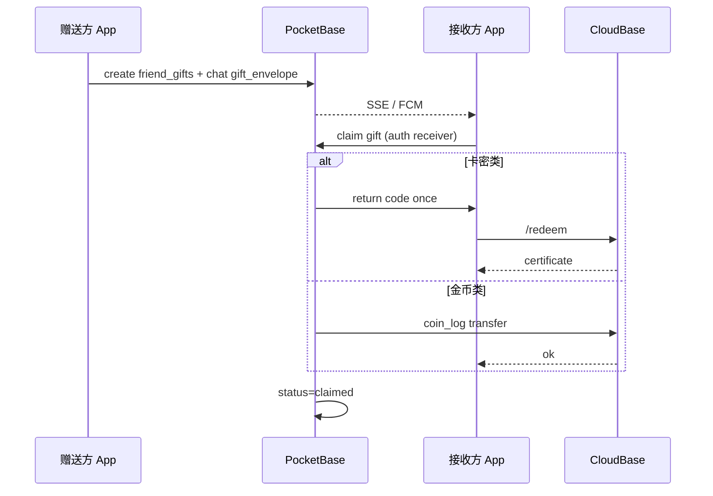

# 🎮🎁 好友社交 · 双人小游戏 & 礼品卡 — 产品与技术设计方案

> **文档性质：** 全面设计稿（**仅设计，未编码**）  
> **前置条件：** Phase 1–2 好友系统已上线（PocketBase + 私聊 + Realtime + FCM）  
> **设计原则：** 复用现有社交栈与经济体系；**不**把 VIP/金币主数据迁到 PocketBase；严格遵守 `DEVELOPMENT_PRINCIPLES.md` 的 `userId` 隔离

**关联文档：**

| 文档 | 关系 |
|------|------|
| `pocketbase/README.md` | 好友 / 聊天 / 推送架构 |
| `chat_ai_entitlement_model_v2.md` | AI 卡 SKU 与额度（可作为礼品类型之一） |
| `backend/shared/sku.js` | 卡密 SKU 定义 |
| `DEVELOPMENT_PRINCIPLES.md` | 多用户数据隔离 |

---

## 一、背景与目标

### 1.1 为什么现在做

| 已有能力 | 缺口 |
|----------|------|
| 好友列表、私聊、SSE 实时、FCM 杀进程推送 | 好友之间**没有一起玩**的入口 |
| 骰子 / 计分 / 转盘等**本地**小游戏 | 无跨设备双人玩法 |
| VIP / 聊天 AI 卡密 / 金币商城 | 无**赠送给好友**的正式链路 |
| `FriendChatScreen` 消息流 | 消息类型仅纯文本 |

### 1.2 目标

1. **趣玩中心：** 独立 **小游戏集合入口**，聚合好友对战、同屏乐玩、进行中对局，点进任意游戏可 **邀请好友 / 开房间 / 续局**。  
2. **社交留存：** 好友页、私聊、首页均可一跳进同一套房间系统，完成一局有仪式感的结果页。  
3. **轻量实时：** 首版以 **回合制 + SSE 推送** 为主，不强依赖长连接对战（降低实现与耗电）。  
4. **商业闭环：** 支持赠送 **礼品卡**（VIP 体验、AI 额度、商城道具包），卡密仍走云端 `/redeem` 安全模型。  
5. **可扩展：** 统一「游戏房间」协议 + **游戏目录配置**，后续上新游戏只加条目与玩法模块，不重做大厅。

### 1.3 非目标（本期不做）

- 陌生人匹配 / 大厅排位 / 全服排行榜（仅好友对战）  
- 语音 / 视频 / 群局（>2 人）  
- 游戏内赌博真钱、提现  
- 把 Room 主库或 CloudBase VIP 逻辑迁到 PocketBase  

---

## 二、产品范围

### 2.1 趣玩中心 · 小游戏集合（核心入口）

**定位：** App 内统一的 **「游戏大厅」**，不是单个游戏页，而是：

```
首页 / 好友页 ──► 趣玩中心 ──► 游戏详情 ──► 邀请好友 | 开房间 | 加入房间
                      │
                      ├─ 好友对战（在线，需 PocketBase）
                      ├─ 同屏乐玩（本地已有：骰子、计分、转盘…）
                      └─ 我的对局（进行中 / 待接受邀请）
```

| 入口 | 位置 | 说明 |
|------|------|------|
| **主入口** | 首页功能宫格 **「趣玩中心」** 🎮 | 与「好友」并列，未配置 PB 时仍展示同屏游戏 |
| **副入口** | `FriendsScreen` 顶栏 / Tab 旁 **「一起玩」** | 直达趣玩中心并默认切到「好友对战」 |
| **上下文入口** | 好友详情 · 私聊卡片 | 「邀请 TA 玩 xxx」预填游戏与对象 |
| **深链** | FCM / 通知 | `funlife://game/room/{roomId}` |

**趣玩中心页结构（3 Tab）：**

| Tab | 内容 |
|-----|------|
| **好友对战** | 在线游戏卡片网格（五子棋、你画我猜、骰子对战…） |
| **同屏乐玩** | 跳转现有本地游戏（`dice_game`、`score_counter` 等），标注「传手机玩」 |
| **我的对局** | 待接受邀请、进行中、最近 7 天战绩 |

### 2.2 游戏目录（Catalog）

所有游戏由 **目录配置** 驱动 UI，避免写死列表。首期用客户端 `SocialGameCatalog.kt`；后期可改为 PocketBase `game_catalog` 远程开关。

| 字段 | 说明 |
|------|------|
| `game_id` | 稳定 ID，与 `game_rooms.game_type` 一致 |
| `title` / `subtitle` | 展示文案 |
| `icon_emoji` | 宫格图标 |
| `category` | `online_pvp` \| `local_party` \| `async_social` |
| `players` | `2` 或 `2-4` |
| `status` | `live` \| `beta` \| `coming_soon` |
| `tags` | `棋类` `派对` `绘画` |
| `min_pb` | 是否依赖 PocketBase（在线游戏为 true） |

**首期目录示例：**

| game_id | 名称 | category | status |
|---------|------|----------|--------|
| `gomoku` | 五子棋 | online_pvp | live |
| `draw_guess` | 你画我猜 | online_pvp | live |
| `dice_duel` | 骰子对战 | online_pvp | beta |
| `truth_relay` | 真心话接力 | async_social | coming_soon |
| `dice_game` | 骰子派对 | local_party | live → 跳 `dice_game` |
| `score_counter` | 计分板 | local_party | live |
| `spin_wheel` | 幸运转盘 | local_party | live |

`coming_soon` 卡片可点「提醒我」仅记本地，不上线逻辑。

**卡片信息层级（宫格 / 列表统一）：**

| 层级 | 展示 |
|------|------|
| 主标题 | `title` |
| 副标题 | `subtitle` 或 `players` + 预计时长 |
| 角标 | `在线` / `同屏` / `BETA` / `NEW` / `即将上线` |
| 底栏 | 最近 7 天玩过的人数（在线游戏，PB 聚合，可选 P4）或「好友在玩」红点 |

**排序规则（趣玩中心 · 好友对战 Tab）：**

1. `status=live` 优先于 `beta` / `coming_soon`  
2. 同状态按 `sort_order` 升序（目录配置字段）  
3. 用户「最近常玩」置顶（本地 `recent_game_ids_${userId}`，最多 2 个）

### 2.3 同屏乐玩 · 与首页游戏映射

趣玩中心 **不复制** 本地游戏逻辑，只做 **聚合入口 + 轻提示导流**。点击卡片 `navigate(local_route)`。

| game_id | 展示名 | 现有 route | 说明 |
|---------|--------|------------|------|
| `dice_game` | 骰子派对 | `dice_game` | 比大小 / 摇骰子，pass-and-play |
| `score_counter` | 游戏计分 | `score_counter` | 多人计分板 |
| `spin_wheel` | 幸运转盘 | `spin_wheel` | 转盘决策 |
| `riddle_game` | 猜谜游戏 | `riddle_game` | 本地题库 |
| `pet` | 宠物屋 | `pet` | 养成向，标注「单人」 |

首期同屏 Tab **精选 4 个**（上表前 4 项）；「更多同屏游戏」展开宫格可进 `pet` 等。  
顶栏横幅（可关）：「想和异地好友玩？试试好友对战里的骰子对战 →」

### 2.4 双人小游戏（在线 · 首期 3 款 + 1 款延伸）

| 优先级 | 游戏 | 模式 | 说明 |
|--------|------|------|------|
| **P1** | **五子棋** | 同步回合 | 15×15，禁手可选（首期可不做禁手）；胜负明确，状态小 |
| **P1** | **你画我猜** | 半实时 | 一人画 60s，对方猜；轮流 3 轮；笔画流式同步 |
| **P2** | **骰子对战** | 同步回合 | 复用现有「比大小」规则，2 人各掷 1 次比点数 |
| **P3** | **真心话接力** | 异步 | 复用骰子模式题库，好友轮流回答（卡片消息） |

### 2.5 好友礼品卡

| 礼品类型 | 来源 SKU | 领取后效果 |
|----------|----------|------------|
| VIP 体验卡 | 新 SKU `GIFT_VIP_TRIAL_7D` 等 | 走 `/redeem`，写 `user_vip` |
| 聊天 AI 体验卡 | `CHAT_AI_TRIAL`（已有） | 走 `redeemChatAi` |
| 金币礼包 | 非卡密：直接 `CoinRepository.addCoins`（需服务端记账） | 到账金币 + 通知 |
| 商城道具包 | 写入 `inventory` | 到背包 |

**原则：** 高价值权益（VIP / AI 卡）**必须**经 CloudBase 卡密或专用云函数签发，**禁止**客户端本地直接写 VIP。

---

## 三、用户旅程

### 3.1 趣玩中心 · 主路径（推荐）

```
首页「趣玩中心」
  → 好友对战 Tab → 点「五子棋」卡片
  → 游戏详情页（规则简介 + 预计时长）
  → 底部双按钮：
        [ 邀请好友 ]          [ 开房间 ]
```

**路径 A · 邀请好友（点名对战）**

```
游戏详情 → 邀请好友 → 好友选择器（仅 accepted 好友）
  → 可选填一句话 → 发送
  → 创建 game_rooms(status=waiting, invite_mode=direct, guest=好友)
  → 对方：通知 + 聊天卡片 + 趣玩中心「我的对局」出现待接受项
  → 接受 → 等待页变为对局页
```

**路径 B · 开房间（房间号 / 链接等人）**

```
游戏详情 → 开房间 → 房间等待页（Lobby）
  → 展示：6 位房间号 + 「发给好友」分享按钮
  → 房主可：更换游戏不可（已锁定）、踢人（仅邀请前）、取消房间
  → 好友侧：
        · 趣玩中心顶部「输入房间号加入」
        · 或聊天里点分享卡片「加入房间」
  → 满 2 人且房主点「开始」→ status=playing
```

| 对比 | 邀请好友 | 开房间 |
|------|----------|--------|
| 对象 | 指定 1 人 | 任一好友可加入（首期仍限好友） |
| 房间号 | 无 | 有，方便在私聊里发 |
| 适用 | 我知道就和谁玩 | 约好几个人谁先谁后、或私聊发码 |

**路径 C · 加入进行中对局**

```
趣玩中心 → 我的对局 → 进行中卡片 → 继续
（或 FCM / 聊天卡片直达 roomId）
```

**路径 D · 同屏乐玩（不建在线房间）**

```
趣玩中心 → 同屏乐玩 Tab → 骰子派对
  → 跳转现有 DiceGameScreen（本地 pass-and-play）
  → 顶栏轻提示：「想和异地好友玩？去好友对战看看骰子对战」
```

### 3.2 从好友页 / 私聊发起（快捷路径）

```
好友列表 → 点好友头像 → 底部菜单
  ├─ 发消息（已有）
  ├─ 送礼物（新）
  └─ 一起玩（新）──► 趣玩中心（预填 peer + 打开好友对战 Tab）

私聊 → 输入栏「+」→ 一起玩 / 送礼物
```

邀请发出后的统一行为：

1. 对方收到 **应用内通知** +（可选）FCM：`game_invite`  
2. 聊天会话插入 **结构化卡片消息**（可点「接受」/「加入房间」）  
3. 接受后进入 **房间等待页或对局页**；拒绝 / 超时邀请作废  

### 3.3 赠送礼品卡

```
好友 → 送礼物 → 选类型（AI 体验 / VIP 7 天 / 100 金币包 …）
  → 确认（部分需消耗自己的金币或已购卡密）
  → 生成「礼品信封」消息
  → 好友点击「拆开」→ 调用领取 API → 到账 + 动画
```

**限制：**

- 每对好友每日送礼次数上限（防刷）  
- 同一 `giftId` 仅可领取一次  
- 领取绑定 `userId` + `deviceId`（与 redeem 一致）

### 3.4 房间生命周期与边界场景

| 场景 | 行为 |
|------|------|
| **房主取消** | `waiting` / `accepted` → `cancelled`；通知 guest；聊天插入系统提示 |
| **被邀请方拒绝** | `waiting`(direct) → `cancelled`；host 收到通知，可「再邀一次」 |
| **邀请超时** | direct 邀请 `waiting` 5 分钟 → `expired`；卡片按钮置灰「已过期」 |
| **空房超时** | `waiting` 且 guest 为空，10 分钟 → `expired` |
| **对局中一方退出** | 弹窗确认 → `abandoned`，另一方 `winner`；或棋类可选「求和」 |
| **断线重连** | 进房拉 `game_rooms` + `game_moves` 全量；SSE 续订；30s 无心跳显示横幅 |
| **再来一局** | 终局页点「再来一局」→ 新建 room，**预填**上局对手与 `game_type` |
| **房间已满** | open 房 guest 非空时，第三人 join 返回 `ROOM_FULL` |
| **非好友加入** | 首期 **拒绝**（校验 `friendships` accepted）；P4 可讨论「房间码公开」 |
| **重复加入** | 已是 guest 的用户点卡片 → 直达 lobby / room，不重复写 guest |
| **房主杀进程** | open 房：`waiting` 保留至 TTL；`playing` 由 guest 可「申请判胜」或等待 host 重连 |

**并发约束（PocketBase Rule 层）：**

- 同一 `pb_user` 同时最多 **1 个** `status ∈ {waiting, accepted, playing}` 的房间（防刷房）  
- `game_moves` 写入必须 `auth.id == current_turn`  
- `room_code` 全局唯一；生成失败重试 3 次

### 3.5 邀请好友 · 交互细项

**好友选择器 `FriendPickerSheet`（复用好友列表数据源）：**

- 仅 `friendships.status = accepted`  
- 支持搜索昵称 / 备注  
- 多选 **关闭**（首期 1v1）；灰显「对方有一局进行中」  
- 选中后可选 **附言**（≤ 50 字，写入 `invite_message`）

**发送后三端一致：**

```
1. game_rooms 记录落库
2. messages 插入 game_invite 或 game_room_share 卡片
3. FCM game_invite（对方离线时）
```

**私聊内快捷操作：**

| 卡片 | 主按钮 | 次按钮 |
|------|--------|--------|
| `game_invite` | 接受 | 拒绝 |
| `game_room_share` | 加入房间 | 复制房间号 |
| `game_result` | 再来一局 | 返回聊天 |

---

## 四、系统架构

```mermaid
flowchart TB
    subgraph Android
        Home[HomeScreen 趣玩中心入口]
        Hub[SocialGameCenterScreen]
        Catalog[SocialGameCatalog]
        Detail[GameDetailScreen]
        Lobby[GameLobbyScreen 等待房]
        Room[GameRoomScreen 对局]
        FriendsUI[FriendsScreen / FriendChat]
        GiftUI[FriendGiftSheet]
        SSM[SocialSessionManager]
        GR[GameRoomRepository]
        RoomCache[(social_game_* Room)]
        Coin[CoinRepository]
        Vip[VipManager /redeem]
    end

    Home --> Hub
    FriendsUI --> Hub
    Hub --> Catalog
    Catalog --> Detail
    Detail --> Lobby
    Detail --> FriendsUI
    Lobby --> Room
    GR --> Room

    subgraph PocketBase
        FR[friendships]
        MSG[messages + msg_type]
        GRoom[game_rooms]
        GMove[game_moves]
        GStroke[game_draw_strokes]
        FGift[friend_gifts]
        Hooks[pb_hooks → FCM]
    end

    subgraph CloudBase
        Redeem[/redeem]
        CoinLog[/coin_log]
    end

    FriendsUI --> SSM
    Room --> GR --> SSM
    GR --> GRoom
    GR --> GMove
    GR --> GStroke
    GiftUI --> FGift
    FGift -->|claim 高价值| Redeem
    FGift -->|claim 金币| CoinLog
    Hooks --> Android
    SSM -->|SSE| GRoom
    SSM -->|SSE| MSG
```

**职责划分：**

| 系统 | 职责 |
|------|------|
| **PocketBase** | 游戏房间状态、回合数据、画猜笔画、礼品信封、聊天卡片消息 |
| **CloudBase** | 卡密生成/兑换、金币审计、VIP/AI 凭证签发 |
| **Room（本地）** | 按 `userId` 缓存房间列表、进行中对局、未读邀请 |

---

## 五、游戏通用协议

### 5.1 房间状态机

```
                    ┌─ direct：waiting(guest 已填) → accepted ─┐
创建 ──► waiting ──┤                                         ├──► playing → finished
       (开房间)     └─ open：guest 加入 ──────────────────────┘
   │                      │
   └─ cancelled/expired/abandoned
```

> **实现说明**：PocketBase API 无法写入 `invited` / `invite_pending` 等含 invite 前缀的 status 值，故**直接邀请与开房间均用 `waiting`**，由 `invite_mode` + 是否已填 `guest` 区分语义。

| 状态 | 含义 |
|------|------|
| `waiting` | 等待中：`open` = 等人加入；`direct` = 已点名好友，等待接受（TTL **5 分钟**） |
| `accepted` | 双方到齐（直接邀请已接受，或 open 房满员），待房主点「开始」 |
| `playing` | 对局进行中 |
| `finished` | 正常终局（胜负/平局） |
| `cancelled` | 发起方取消 |
| `expired` | 超时未接受 / 空房超时（**10 分钟**无人加入则解散） |
| `abandoned` | 一方退出 / 断线超时判负（可配置） |

### 5.2 邀请模式 `invite_mode`

| 值 | 行为 |
|----|------|
| `direct` | 指定 `guest_pb_id`，仅此人可接受 |
| `open` | 不指定 guest；好友凭 `room_code` 加入，满员后 `accepted` |

**房间号 `room_code`：** 6 位大写字母+数字，PB 唯一索引；仅 `invite_mode=open` 时生成。

### 5.3 角色

| 字段 | 说明 |
|------|------|
| `host_pb_id` | 发起邀请的 PocketBase 用户 |
| `guest_pb_id` | 被邀请方 |
| `current_turn_pb_id` | 当前回合方（棋类、骰子） |
| `winner_pb_id` | 终局胜方；null = 平局或未结束 |

### 5.4 消息类型扩展（`messages` 集合）

在现有 `body` 文本外，增加可选字段（PB 自定义字段）：

| 字段 | 类型 | 说明 |
|------|------|------|
| `msg_type` | Text | `text` \| `game_invite` \| `game_room_share` \| `game_result` \| `gift_envelope` |
| `payload` | JSON | 结构化内容（room_id、room_code、game_id、gift_id 等） |

**卡片类型预览：**

| msg_type | 卡片展示 |
|----------|----------|
| `game_invite` | 「邀请你下五子棋」[ 接受 ] [ 拒绝 ] |
| `game_room_share` | 「房间号 AB12CD · 你画我猜」[ 加入 ] |
| `game_result` | 「五子棋 · 你赢了 🎉」[ 查看复盘 ] |
| `gift_envelope` | 「送你一份礼物」[ 拆开 ] |

聊天 UI 根据 `msg_type` 渲染卡片，而非纯文本。

### 5.5 实时与同步策略

| 场景 | 机制 |
|------|------|
| 邀请/接受 | SSE `game_rooms` create/update + 聊天卡片 |
| 五子棋落子 | 写 `game_moves` → SSE → 对方拉取增量 |
| 你画我猜笔画 | 批量写 `game_draw_strokes`（每 200ms 或抬笔 flush） |
| 后台/杀进程 | FCM `game_turn` / `game_invite` → 点通知进房间 |
| 冲突 | **服务端裁决**：以 PocketBase 写入顺序为准；客户端乐观 UI + 回滚 |

**首期不做** WebRTC；画猜通过笔画点列同步（类似简化白板）。

### 5.6 PocketBase API 约定（客户端调用）

标准 CRUD 为主；复杂动作可用 **PB 自定义 Route** 或 **Hooks 校验**（与现有 `messages` 一致）。

| 动作 | 方法 | 说明 |
|------|------|------|
| 创建直接邀请 | `POST /api/collections/game_rooms/records` | `invite_mode=direct`, `guest`, `game_type`, `status=waiting` |
| 创建开放房间 | `POST` 同上 | `invite_mode=open`, `status=waiting`, 客户端生成 `room_code` |
| 接受邀请 | `PATCH` room | `status: accepted`；Rule：仅 `guest` 且原 `invite_mode=direct` |
| 房间号加入 | `GET ?filter=room_code='{code}'&status='waiting'` | 找到后 `PATCH` 写 `guest` |
| 准备 / 开始 | `PATCH` | `host_ready` / `guest_ready`；房主 `start` → `playing` + 初始化 `game_state` |
| 落子 / 掷骰 | `POST /api/collections/game_moves/records` | Hook 校验轮次、更新 `game_rooms.game_state` |
| 认输 | `PATCH` room | `status=finished`, `winner=对手` |
| 我的对局列表 | `GET game_rooms` | `filter=(host='me' \|\| guest='me') && status!='cancelled'` sort `-updated` |

**错误码（`payload.code`）：**

| code | 含义 |
|------|------|
| `ROOM_FULL` | 房间已满 |
| `ROOM_EXPIRED` | 已过期 |
| `NOT_YOUR_TURN` | 非当前回合 |
| `NOT_FRIEND` | 非好友无法加入 |
| `ALREADY_IN_ROOM` | 已有进行中对局 |
| `INVALID_MOVE` | 落子非法 |

### 5.7 房间号生成

```text
字符集: 23456789ABCDEFGHJKLMNPQRSTUVWXYZ  （去掉 0/O/1/I 防混淆）
长度: 6
唯一: game_rooms.room_code UNIQUE INDEX
```

分享文案模板：`「来一局五子棋！房间号 K7M2P9 — 打开趣生活 → 趣玩中心 → 输入房间号」`

---

## 六、游戏详细设计

### 6.1 五子棋（Gomoku）

**规则（MVP）：**

- 15×15 棋盘，黑先（发起方为黑）  
- 五子连珠即胜  
- 长连、禁手：**首期不做**（降低争议）  
- 单局最长 **200 手** 或 **30 分钟**，否则平局  

**状态 `game_state`（JSON）：**

```json
{
  "board": "empty | black | white, length=225",
  "lastMove": { "x": 7, "y": 7, "color": "black" },
  "moveCount": 42
}
```

**流程：**

1. Host 邀请 → Guest 接受 → `status=playing`，`current_turn=host`（黑）  
2. 每手：`POST game_moves { room_id, x, y }` → 服务端校验轮次、空位、胜负 → 更新 `game_rooms.game_state`  
3. 终局：写 `game_result` 聊天卡片 + 本地可选写 `game_history`（扩展）

**UI：**

- 棋盘 Compose Canvas + 最后一手高亮  
- 对方落子后短震动 + 音效（沿用现有游戏音效风格）  
- 结果页：胜负动画 + 「再来一局」「返回聊天」

---

### 6.2 你画我猜（Draw & Guess）

**规则（MVP）：**

- 共 **3 轮**；每轮：画家 60s，猜家有 **5 次** 提交机会  
- 词库：内置 200 词（分类：食物/动物/电影/成语）；**不接 AI 生成**（首期）  
- 得分：猜对 +1，轮结束互换角色；3 轮后比总分  

**轮次状态：**

```json
{
  "round": 1,
  "phase": "drawing | guessing | round_end",
  "drawer_pb_id": "...",
  "word": "encrypted_or_server_only",
  "guesses": [{ "pb_id", "text", "correct": false }],
  "scores": { "host": 1, "guest": 0 },
  "stroke_seq": 128
}
```

**安全：** `word` 仅下发给画家客户端；猜家接口不返回明文。

**笔画同步：**

- 表 `game_draw_strokes`：`room_id`, `seq`, `points`（压缩 JSON）, `color`, `width`  
- 猜家 SSE 订阅 stroke 增量绘制  
- 清屏 = 特殊 stroke 类型 `clear`

**UI：**

- 画家：粗笔触 + 3 色 + 橡皮  
- 猜家：只看画、输入框提交  
- 轮间：词揭晓 + 得分板  

---

### 6.3 骰子对战

复用 `DiceGameViewModel` 的 **比大小** 规则：

- 双方各 `roll()` 一次（服务端 `Random` 或 commit-reveal 防作弊）  
- 大者胜；平局再来一次（最多 3 次加赛）  
- 状态极小，适合作为 **技术验证第一款**（可选 P0 试点）

### 6.4 未来小游戏路线图（目录预留）

以下写入 `SocialGameCatalog`，默认 `coming_soon`，便于运营逐步点亮：

| game_id | 名称 | category | 玩法概要 |
|---------|------|----------|----------|
| `reversi` | 黑白棋 | online_pvp | 8×8，翻转棋子 |
| `tic_tac_toe` | 井字棋 | online_pvp | 3×3，快速对局，适合新手引导 |
| `word_chain` | 词语接龙 | async_social | 异步回合，聊天卡片续句 |
| `quick_quiz` | 默契问答 | online_pvp | 同题双选，比一致率 |
| `emoji_guess` | 表情猜词 | online_pvp | 用表情组合猜词 |
| `dice_party_online` | 骰子派对·在线 | online_pvp | 本地 `dice_game` 规则的 2 人在线版 |

**上新流程：** 加目录项 → 实现 `SocialGamePlugin` → PB `game_type` 枚举扩展 → E2E 一条 → 远程 `game_catalog.status=live`（P4）。

---

## 七、好友礼品卡设计

### 7.1 礼品类型与实现路径

| type | 实现 | 发起方成本 |
|------|------|------------|
| `ai_trial` | 后台预生成 `CHAT_AI_TRIAL` 码 → 绑 `friend_gifts` → 领取调 `/redeem` | 运营配额 / 活动免费 |
| `vip_trial` | 新 SKU `GIFT_VIP1_7D`（`type: gift_vip`） | 金币或人民币购卡 |
| `coins` | CloudBase `coin_log` 转账式记账 | 扣发起方金币 |
| `inventory_pack` | 领取写本地 `inventory` + 云审计 | 扣发起方库存或金币 |

### 7.2 `friend_gifts` 集合

| 字段 | 类型 | 说明 |
|------|------|------|
| `sender` | Relation→users | 赠送方 |
| `receiver` | Relation→users | 接收方 |
| `gift_type` | Text | 见上表 |
| `sku_code` | Text? | 卡密类礼品 |
| `code` | Text? | 加密存储的兑换码（仅领取时解密下发） |
| `coins_amount` | Number? | 金币礼 |
| `status` | Text | `pending` / `claimed` / `expired` |
| `message` | Text | 赠言（≤ 100 字） |
| `expires_at` | Date | 默认 7 天 |
| `claimed_at` | Date? | |
| `claimed_by_local_id` | Number? | 审计 |

**领取流程：**



### 7.3 防刷与风控

| 风险 | 对策 |
|------|------|
| 小号互刷金币 | 好友需 `accepted` ≥ 7 天才能送金币；每日上限 |
| 卡密泄露 | `code` 字段 PB 仅 admin 可读；领取接口一次性返回 |
| 重复领取 | `status` 原子 `pending→claimed` |
| 自用刷体验卡 | TRIAL 仍受 `deviceId` + `userId` 终身一次（已有） |

---

## 八、数据模型

### 8.1 PocketBase 新集合

#### `game_rooms`

| 字段 | 类型 |
|------|------|
| `game_type` | `gomoku` \| `draw_guess` \| `dice_duel` \| … |
| `invite_mode` | `direct` \| `open` |
| `room_code` | Text?（6 位，open 模式唯一） |
| `host`, `guest` | Relation→users（direct 时 guest 必填；open 时 guest 加入后写入） |
| `status` | `waiting` \| `accepted` \| `playing` \| `finished` \| `cancelled` \| `expired` \| `abandoned` |
| `host_ready`, `guest_ready` | Bool（等待页准备） |
| `current_turn` | Relation→users? |
| `winner` | Relation→users? |
| `game_state` | JSON |
| `invite_message` | Text?（邀请附言，≤ 50 字） |
| `expires_at` | Date |
| `finished_at` | Date? |

索引：`(host, status)`, `(guest, status)`, `room_code`（unique）, `updated`

Rules：仅 `host` / `guest` 可读；`open` 房 join 需校验双方为 `accepted` 好友。

#### `game_catalog`（可选 · P4 远程配置）

| 字段 | 类型 |
|------|------|
| `game_id` | Text unique |
| `title`, `subtitle`, `icon` | Text |
| `category`, `status` | Text |
| `sort_order` | Number |
| `min_app_version` | Text? |

首期可仅用客户端 Kotlin 常量，结构与此对齐便于后期迁移。

#### `game_moves`

| 字段 | 类型 |
|------|------|
| `room` | Relation→game_rooms |
| `player` | Relation→users |
| `move_index` | Number |
| `payload` | JSON（坐标 / 骰子点数 / 猜词） |

#### `game_draw_strokes`

| 字段 | 类型 |
|------|------|
| `room` | Relation→game_rooms |
| `seq` | Number |
| `stroke_data` | JSON |

#### `friend_gifts`

见 §7.2。

### 8.2 Android Room 缓存（均含 `userId`）

| 表 | 用途 |
|----|------|
| `social_game_room_cache` | 进行中 / 最近房间 |
| `social_game_invite_cache` | 待处理邀请 |
| `social_gift_cache` | 礼品信封列表 |

**禁止** `userId` 默认值；DAO 全部 `WHERE userId = :userId`。

#### `game_catalog`（可选 · P4 远程开关）

| 字段 | 类型 | 说明 |
|------|------|------|
| `game_id` | Text UNIQUE | 与客户端目录一致 |
| `title`, `subtitle` | Text | 可覆盖本地文案 |
| `status` | Text | `live` / `beta` / `hidden` |
| `sort_order` | Number | 排序 |
| `min_app_version` | Text? | 低版本隐藏 |
| `banner_url` | Text? | 详情页头图 |

客户端启动时：有网则 merge 远程 `status` / 文案；无网用内置 `SocialGameCatalog`。

### 8.3 Android 模块划分（建议包路径）

```
com.example.funlife.social.game
  ├─ catalog/SocialGameCatalog.kt      // 游戏目录
  ├─ model/GameRoomModels.kt
  ├─ GameRoomRepository.kt
  ├─ GameRoomInteractor.kt
  ├─ ui/SocialGameCenterScreen.kt
  ├─ ui/GameDetailScreen.kt
  ├─ ui/GameLobbyScreen.kt
  ├─ ui/GameRoomScreen.kt
  ├─ ui/board/GomokuBoard.kt           // 各游戏 UI 插件化
  └─ engine/GomokuRules.kt               // 纯规则，可单测
```

**插件约定：** 每个 `game_id` 注册 `SocialGamePlugin`（详情文案、Room 内 Compose、胜负解析）。  
完整路由表见 **§9.7**。

### 8.4 内置目录配置示例（`SocialGameCatalog.kt`）

```kotlin
data class SocialGameEntry(
    val gameId: String,
    val title: String,
    val subtitle: String,
    val iconEmoji: String,
    val category: GameCategory,       // ONLINE_PVP | LOCAL_PARTY | ASYNC_SOCIAL
    val playersLabel: String,         // "2人在线"
    val status: GameCatalogStatus,    // LIVE | BETA | COMING_SOON
    val localRoute: String? = null,   // 同屏游戏跳转 Nav route
    val minPocketBase: Boolean = false,
    val sortOrder: Int = 0,
    val tags: List<String> = emptyList(),
)

object SocialGameCatalog {
    val all: List<SocialGameEntry> = listOf(
        SocialGameEntry("gomoku", "五子棋", "经典 15×15", "⚫", ONLINE_PVP, "2人在线", LIVE, minPocketBase = true, sortOrder = 1, tags = listOf("棋类")),
        SocialGameEntry("draw_guess", "你画我猜", "画画猜词", "🎨", ONLINE_PVP, "2人在线", LIVE, minPocketBase = true, sortOrder = 2),
        SocialGameEntry("dice_duel", "骰子对战", "比点数", "🎲", ONLINE_PVP, "2人在线", BETA, minPocketBase = true, sortOrder = 3),
        SocialGameEntry("truth_relay", "真心话接力", "异步问答", "💬", ASYNC_SOCIAL, "2人", COMING_SOON, sortOrder = 10),
        SocialGameEntry("dice_game", "骰子派对", "传手机玩", "🎲", LOCAL_PARTY, "2~6人", LIVE, localRoute = "dice_game", sortOrder = 20),
        SocialGameEntry("score_counter", "游戏计分", "聚会计分", "🎵", LOCAL_PARTY, "多人", LIVE, localRoute = "score_counter", sortOrder = 21),
        // ...
    )

    fun onlineGames() = all.filter { it.category == ONLINE_PVP && it.status != COMING_SOON }
    fun localPartyGames() = all.filter { it.category == LOCAL_PARTY }
}
```

`SocialGamePlugin` 注册表（Koin / 手动 Map）：

```kotlin
interface SocialGamePlugin {
    val gameId: String
    @Composable fun GameBoard(room: GameRoomUiState, onAction: (GameAction) -> Unit)
    fun parseWinner(state: JsonObject): String?  // pb user id
}
```

---

## 九、UI / 入口设计

### 9.1 趣玩中心 `SocialGameCenterScreen`

**布局草图：**

```
┌─────────────────────────────────────┐
│  ←  趣玩中心          🔔 待处理(2)   │
├─────────────────────────────────────┤
│ [ 好友对战 ] [ 同屏乐玩 ] [ 我的对局 ]│
├─────────────────────────────────────┤
│  🔍 输入房间号加入    [ 加入 ]        │  ← 仅好友对战 Tab
├─────────────────────────────────────┤
│  ┌────────┐ ┌────────┐ ┌────────┐ │
│  │ 五子棋  │ │你画我猜│ │骰子对战│ │
│  │ 2人在线 │ │ 2人在线│ │  BETA  │ │
│  └────────┘ └────────┘ └────────┘ │
│  ┌────────┐ ┌────────┐            │
│  │真心话  │ │ 更多   │            │
│  │即将上线│ │        │            │
│  └────────┘ └────────┘            │
└─────────────────────────────────────┘
```

- 视觉：与首页宫格一致的渐变卡片 + 角标（`在线` / `同屏` / `NEW`）  
- 未配置 PocketBase：隐藏「好友对战」「我的对局」在线部分，同屏 Tab 仍可用，顶栏提示「配置社交服务后可和好友在线玩」

### 9.2 游戏详情 `GameDetailScreen`

```
┌─────────────────────────────────────┐
│  [ 大图/emoji ]   五子棋              │
│  经典 15×15 · 约 5~15 分钟 · 2 人     │
│  规则折叠说明…                       │
├─────────────────────────────────────┤
│  [ 邀请好友 ]     [ 开房间 ]          │
└─────────────────────────────────────┘
```

从好友上下文进入时，「邀请好友」跳过选择器，直接对应该好友。

### 9.3 房间等待页 `GameLobbyScreen`

```
┌─────────────────────────────────────┐
│  你画我猜 · 等待中                    │
│  房间号  K7M2P9  [ 复制 ] [ 发给好友 ] │
├─────────────────────────────────────┤
│  👤 我（房主）          ✓ 已准备      │
│  👤 好友位              等待加入…    │
├─────────────────────────────────────┤
│  [ 开始游戏 ]  （房主，满员后可点）    │
│  [ 取消房间 ]                         │
└─────────────────────────────────────┘
```

直接邀请模式：guest 未接受前显示「等待 TA 接受邀请」；接受后自动变为准备态。

### 9.4 首页 & 好友页入口

| 位置 | 改动 |
|------|------|
| `HomeScreen` 宫格 | 新增 **「趣玩中心」🎮**（`social_game_center`），放在「好友」旁 |
| `FriendsScreen` | 顶栏右侧图标或 Tab 下 **「一起玩」** → 趣玩中心 |
| 好友详情 Sheet | **一起玩** / **送礼物**（预填 peer） |
| `FriendChatScreen` | `+` 菜单：**一起玩**、**送礼物** |

「消息」Tab 会话列表：预览支持 `🎮 五子棋邀请` / `🎁 礼物待拆开` / `🔑 房间 K7M2P9`。

### 9.5 对局壳 `GameRoomScaffold`

- 顶栏：对方头像 + 昵称 + 回合提示 + 房间号（可复制举报）  
- 中部：各游戏自定义 `GameBoard`（`GomokuBoard`、`DrawGuessCanvas`…）  
- 底栏：认输 / 求和（棋类）/ 退出  
- 断线横幅：「正在重连…」；重连失败提供「返回大厅」

### 9.6 礼品动画

- 拆开：Lottie 或 Compose 礼花 + 显示到账内容  
- 卡密类：自动复制 optional + 「已激活」状态  

### 9.7 导航路由（完整）

| Route | 屏幕 |
|-------|------|
| `social_game_center` | 趣玩中心（3 Tab） |
| `social_game_detail/{gameId}` | 游戏详情 |
| `social_game_detail/{gameId}?peerPbId=` | 详情（预填好友） |
| `social_game_lobby/{roomId}` | 房间等待 |
| `social_game_room/{roomId}` | 对局主界面 |
| `social_game_join?code=` | 深链：房间号加入 |
| `friend_gift_compose/{peerPbId}` | 选礼品 |
| `friend_gift_open/{giftId}` | 拆礼物 |

ViewModel key 示例：`game_center_${userId}`、`game_room_${userId}_${roomId}`。

### 9.8 空状态与引导

| 页面 | 空状态文案 | 主 CTA |
|------|------------|--------|
| 好友对战（无 PB） | 「配置社交账号后，可和好友在线对战」 | 去好友页绑定 |
| 好友对战（无好友） | 「还没有好友，先加个好友吧」 | 添加好友 |
| 我的对局 | 「暂无进行中对局」 | 去好友对战 |
| 等待页（仅房主） | 「把房间号发给好友，或从好友列表邀请」 | 发给好友 |
| 游戏详情 `coming_soon` | 「即将上线，点击提醒我」 | 本地记 `notify_game_${gameId}` |

**新手引导（仅首次 `game_center_tutorial_seen_${userId}`）：**

1. 高亮「好友对战」与「同屏乐玩」区别  
2. 演示「开房间 → 复制房间号」  
3. 可跳过

### 9.10 UI 视觉规范（**必须遵守**）

> **硬性要求：** 趣玩中心及全部子页（详情 / 等待房 / 对局 / 礼品）均为 **全屏沉浸**，**不得出现 App 底部主导航栏**（首页 Tab 栏）。与 `dice_game`、`friends`、`friend_chat` 同级处理。

**沉浸路由登记（`MainActivity.hideBottomBarRoutes`）：**

- `social_game_center` 及带 query 的变体  
- `social_game_detail/{gameId}`（`startsWith("social_game_detail/")`）  
- `social_game_lobby/{roomId}`、`social_game_room/{roomId}`  
- `friend_gift_compose`、`friend_gift_open`  

**视觉方向 ·「星夜趣玩」主题：**

| Token | 值 | 用途 |
|-------|-----|------|
| `bgDeep` | `#0A0E27` → `#1A1040` → `#2D1B69` 纵向渐变 | 全页背景 |
| `accentViolet` | `#8B5CF6` | 主 CTA、Tab 选中 |
| `accentCyan` | `#22D3EE` | 在线角标、房间号高亮 |
| `glassSurface` | 白 10% + 1dp 渐变描边 | 游戏卡片、信息块 |
| `inkPrimary` | `#F8FAFC` | 主文字 |
| `inkMuted` | `#94A3B8` | 副文案 |

**组件层级：**

1. `SocialGameScaffold` — 渐变底 + `statusBarsPadding` + 顶栏（返回 / 标题 / 可选操作）  
2. `GameCatalogCard` — 每款游戏独立 **accent 渐变**（五子棋靛蓝、画猜珊瑚、骰子琥珀…）+ 大 emoji + 角标  
3. `HubTabRow` — 胶囊 Tab + 弹性指示器动画（非 Material 默认下划线）  
4. `RoomCodeChip` — 等宽大字 + 复制 / 分享动效  
5. 对局页 `GameRoomScaffold` — 顶栏半透明毛玻璃，棋盘区留足安全边距  

**动效（克制、不抢戏）：**

- 卡片 `fadeIn + slideInVertically` 错峰 50ms  
- Tab 切换 `Crossfade`  
- 按钮按压 `scale(0.97f)`  
- 禁止全屏持续旋转/闪烁（遵守 `DEVELOPMENT_PRINCIPLES` §四）

**开发原则对照（游戏模块）：**

| 原则 | 落地 |
|------|------|
| `userId` 显式传参 | `GameCenterViewModel(currentUserId)`；Prefs key `u${userId}_…` |
| ViewModel key | `game_center_${userId}`、`game_room_${userId}_${roomId}` |
| 未登录 | 跳转 Login，禁止 `userId` 兜底 |
| 登出 | `recreate()` 后本地 `LocalGameRoomDraft` 自然清空 |
| Room 缓存（后期） | Entity 含 `userId` + DAO 过滤 |

### 9.11 首页宫格改动（`HomeScreen`）

在 `FuncItem` 列表 **「好友」旁** 插入：

```kotlin
FuncItem("趣玩中心", "🎮", listOf(Color(0xFF7C4DFF), Color(0xFF536DFE)), "social_game_center"),
```

`MainActivity` 深链白名单增加：`social_game_center`、`social_game_join`。

---

## 十、推送与 Realtime

### 10.1 SSE 订阅扩展

`FriendRealtimeHub` 增加集合：

```json
["friendships", "messages", "game_rooms", "friend_gifts"]
```

### 10.2 FCM 类型（`pb_hooks` 扩展）

| type | 触发 |
|------|------|
| `game_invite` | `game_rooms` create, `invite_mode=direct` && `status=waiting` |
| `game_turn` | `game_moves` create（对方回合） |
| `game_result` | room status→finished |
| `friend_gift` | `friend_gifts` create |

### 10.3 通知文案示例

- 「小明 邀请你下五子棋」  
- 「该你画了！你画我猜 第 2 轮」  
- 「小红 送你一份 AI 体验卡，点击查看」  

---

## 十一、经济与商城联动

### 11.1 游戏内消耗（可选，P3+）

| 项目 | 说明 |
|------|------|
| 发起高级局 | 输家付 5 金币（非首期） |
| 礼品包装 | 花 10 金币换定制赠言皮肤 |

首期 **对战免费**，避免影响留存。

### 11.2 商城新增

| 商品 | 说明 |
|------|------|
| 「好友礼品盒」道具 | 打开可选赠礼界面 |
| 画猜词包扩展 | VIP 专属词库（后期） |

### 11.3 新 SKU（`sku.js` 扩展）

```javascript
GIFT_VIP1_7D: {
  type: "gift_vip",
  name: "VIP体验·7天",
  vipLevel: 1,
  durationDays: 7,
  bonusCoins: 0,
  giftable: true,
},
GIFT_COINS_100: {
  type: "gift_coins",
  name: "金币礼包·100",
  coins: 100,
  giftable: true,
},
```

`/redeem` 扩展 `gift_vip`；金币礼包走专用 `gift_claim` 云函数。

---

## 十二、安全与开发原则

### 12.1 必须遵守（摘自 DEVELOPMENT_PRINCIPLES）

1. 所有 Repository / DAO **`userId` 显式传参**，禁止默认 `1L`  
2. ViewModel **`currentUserId` 构造注入**；NavGraph **`viewModel(key = "..._${userId}")`**  
3. 登出 / 换号：`Activity.recreate()` + 清 `social_game_*` 缓存  
4. SharedPreferences：`game_invite_seen_${userId}` 等按用户隔离  
5. 高价值权益 **云端签发**，客户端只展示结果  

### 12.2 游戏防作弊

| 点 | 方案 |
|----|------|
| 骰子点数 | 服务端生成；客户端仅展示 |
| 五子棋落子 | 服务端校验合法性与轮次 |
| 画猜词泄露 | 词存在 `game_rooms` 服务端字段，按角色过滤 API |
| 时钟 | 回合超时以服务端 `updated` 为准 |

---

## 十三、分期实施计划

| 阶段 | 内容 | 预估 |
|------|------|------|
| **P0 基建** | PB schema；`msg_type`；SSE+FCM；`GameRoomRepository`；**趣玩中心壳 + 目录 + 空状态** | 1–2 周 |
| **P0b 大厅** | 游戏详情、开房间/邀请、等待页、`room_code`、我的对局列表 | 1 周 |
| **P1b 骰子对战** | 最小在线对局验证（可先于五子棋） | 3–5 天 |
| **P1a 五子棋** | 完整对局 + 结果卡片 | 1–2 周 |
| **P2 你画我猜** | 笔画同步 + 词库 + 3 轮 | 2–3 周 |
| **P3 礼品卡** | `friend_gifts` + 聊天信封 + 领取 | 1–2 周 |
| **P4 增强** | 远程 `game_catalog`、战绩、真心话、首页运营位 | 按需 |

**推荐落地顺序：** P0 → P0b（**先能逛大厅、开空房**）→ P1b → P1a → P3 → P2

**里程碑可视性：**

| 里程碑 | 用户可感知 |
|--------|------------|
| P0+P0b | 首页有「趣玩中心」，能开房间、邀请好友（游戏可先「敬请期待」占位） |
| P1b | 骰子对战全链路跑通 |
| P1a+ | 棋盘类游戏上线，同屏 Tab 导流本地游戏 |

---

## 十四、测试策略

| 层级 | 内容 |
|------|------|
| **Node E2E** | `pocketbase/tools/test_game_room_e2e.js`：邀请、落子、终局 |
| **Node E2E** | `test_friend_gift_e2e.js`：送礼、领取、重复领取拒绝 |
| **Kotlin 单测** | 五子棋胜负判定、状态机迁移 |
| **真机** | 双机好友：杀进程后 FCM 进房 |

---

## 十五、验收标准（首期）

1. 首页可进入 **趣玩中心**，三个 Tab 切换正常；无 PB 时同屏 Tab 仍可进本地游戏。  
2. 五子棋详情页可 **邀请好友** 与 **开房间**，房间号可复制并在私聊分享后加入。  
3. 好友 A 向 B 发起对战，B 在 **30 秒内**收到通知并能从「我的对局」或聊天卡片进房。  
4. 完整下完一局，胜负正确，聊天出现 `game_result` 卡片。  
5. A 送 `CHAT_AI_TRIAL` 礼品，B 拆开并成功激活（受终身一次限制）。  
6. 非好友 / 错误房间号 / 过期房间 **无法**加入。  
7. 换账号后看不到上一账号的房间与礼品缓存。  

---

## 十六、待产品确认

- [ ] 五子棋是否启用禁手 / 三三规则？  
- [ ] 画猜词库是否允许用户自定义词（UGC 审核）？  
- [ ] 礼品金币是否要求好友满 7 天？满多少天？  
- [ ] 输棋是否扣金币（竞技向 vs 休闲向）？  
- [x] ~~游戏入口~~ → **首页趣玩中心 + 好友页快捷入口**（见 §2.1、§9.4）  
- [ ] 开房间是否允许「非好友输入房间号」加入？（首期建议 **仅好友**）  
- [ ] 同屏乐玩是否要在趣玩中心显示 **全部** 首页游戏，还是仅精选 3~4 个？（设计建议：**精选 4 + 更多展开**，见 §2.3）  
- [ ] VIP 体验礼品是否走新 SKU，还是直接复用现有 `VIP_NORMAL` 短天数卡？  
- [ ] 对局中退出的判负等待时间：**立即判负** vs **30s 重连窗**？  
- [ ] 「我的对局」是否展示 **已结束** 战绩，还是仅进行中 + 待接受？  
- [ ] 开房间是否支持 **更换游戏**（仅 waiting 且 guest 为空时）？  

---

**文档版本：** v1.3 · 2026-06-03  
**状态：** P0 **已编码**（PB `game_rooms` + 房间同步 + 趣玩中心壳）；P1b 骰子对战待做

**v1.3 变更摘要：** §9.10 星夜趣玩视觉规范、全屏沉浸（隐藏底栏）硬性要求、开发原则对照表。
